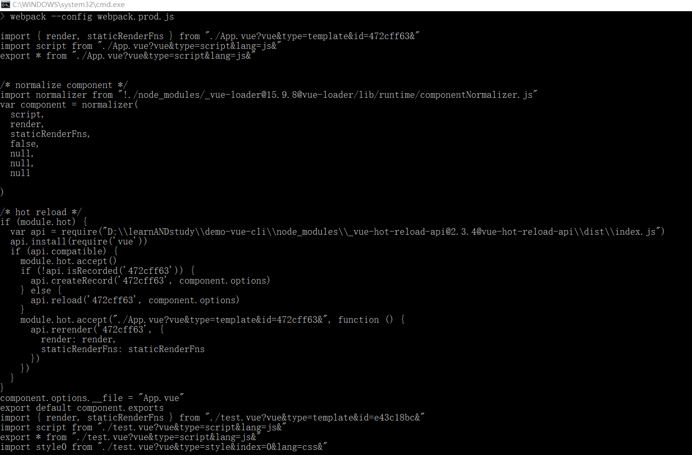

# vue-loader
  loader在webpack里是用来做编译的，这就可以理解vue-loader是帮助我们把我们写的vue组件编译成js文件(因为我们的浏览器是识别不了我们的vue组件的)
# vue-loader的index.js

 vue-loader的index.js导出了一个函数,函数接收一个参数，这个参数就是要转换的文件的内容
```JavaScript
  module.exports = function (source) {
  //source就是传入的文件(传入的文件里的所有代码)
  //........
  }
```
  导出的这个函数里也有this,这个this是webpack注入给我们的,这个this里包含了文件的信息，以及文件的模块组成

   接下来就是解析我们的模块，我们首先通过resourceQuery(webpack注入给我们的this里的信息)获取到我们的vue组件有多少个模块(正常都是template,style,script),然后传入selectBlock函数进行解析，最后返回

```JavaScript
  const loaderContext = this
  if (!errorEmitted && !loaderContext['thread-loader'] && !loaderContext[NS]) {
    loaderContext.emitError(new Error(
      `vue-loader was used without the corresponding plugin. ` +
      `Make sure to include VueLoaderPlugin in your webpack config.`
    ))
    errorEmitted = true
  }

  const stringifyRequest = r => loaderUtils.stringifyRequest(loaderContext, r)

  const {
    target,
    request,
    minimize,
    sourceMap,
    rootContext,
    resourcePath,
    resourceQuery = ''
  } = loaderContext
  const rawQuery = resourceQuery.slice(1)
  const inheritQuery = `&${rawQuery}`
  const incomingQuery = qs.parse(rawQuery)
  const options = loaderUtils.getOptions(loaderContext) || {}

  const isServer = target === 'node'
  const isShadow = !!options.shadowMode
  const isProduction = options.productionMode || minimize || process.env.NODE_ENV === 'production'
  const filename = path.basename(resourcePath)
  const context = rootContext || process.cwd()
  const sourceRoot = path.dirname(path.relative(context, resourcePath))
  //通过parse解析文件，获取不同的类型比如,template,style,srcipt等
  //parse返回的是函数的内容
  const descriptor = parse({
    source,//文件内部模块的组成，分别是template,style,script
    compiler: options.compiler || loadTemplateCompiler(loaderContext),
    filename, //文件的名字
    sourceRoot, //文件路径
    needMap: sourceMap
  })
  // if the query has a type field, this is a language block request
  // e.g. foo.vue?type=template&id=xxxxx
  // and we will return early
  //判断文件有没有type,这个type就是文件里的模块，比如index.vue文件里有style,template等模块
  //那么他的type就是  index.vue?type=template  ,index.vue?type=style,然后将这些模块传入selectBlock进行解析
  //为什么要判断因为第一次进入的时候是index.vue是不带type的但是还是要对code进行loader处理，所以仅从判断
  if (incomingQuery.type) {
    return selectBlock(
      descriptor,
      loaderContext,
      incomingQuery,
      !!options.appendExtension
    )
  }

```
如果没有type就对code进行处理后返回

```JavaScript
//如果没有type字段则导出code源码
  // module id for scoped CSS & hot-reload
  const rawShortFilePath = path
    .relative(context, resourcePath)
    .replace(/^(\.\.[\/\\])+/, '') //源码文件名称和路径

  const shortFilePath = rawShortFilePath.replace(/\\/g, '/') + resourceQuery
  //短文件名称和路径
  const id = hash(
    isProduction ?
    (shortFilePath + '\n' + source.replace(/\r\n/g, '\n')) :
    shortFilePath
  ) //文件id
  // feature information 文件特征信息
  const hasScoped = descriptor.styles.some(s => s.scoped) //寻找是否有scoped
  const hasFunctional = descriptor.template && descriptor.template.attrs.functional //寻找template是否有function
  const needsHotReload = (
    !isServer &&
    !isProduction &&
    (descriptor.script || descriptor.template) &&
    options.hotReload !== false
  )
  //判断有没有template
  // template
  let templateImport = `var render, staticRenderFns`
  let templateRequest
  if (descriptor.template) {
    const src = descriptor.template.src || resourcePath //文件的路径
    const idQuery = `&id=${id}` //文件的id
    const scopedQuery = hasScoped ? `&scoped=true` : `` //是否带有scoped
    const attrsQuery = attrsToQuery(descriptor.template.attrs) //attr属性
    const query = `?vue&type=template${idQuery}${scopedQuery}${attrsQuery}${inheritQuery}` //累加所有的type
    const request = templateRequest = stringifyRequest(src + query) //文件的全部比如 index.vue?vue&type=template&scoped=true
    templateImport = `import { render, staticRenderFns } from ${request}`
  }
  // script 判断有没有script
  let scriptImport = `var script = {}`
  if (descriptor.script) {
    const src = descriptor.script.src || resourcePath
    const attrsQuery = attrsToQuery(descriptor.script.attrs, 'js')
    const query = `?vue&type=script${attrsQuery}${inheritQuery}`
    const request = stringifyRequest(src + query)
    scriptImport = (
      `import script from ${request}\n` +
      `export * from ${request}` // support named exports
    )
  }

  // styles  判断styles
  let stylesCode = ``
  if (descriptor.styles.length) {
    stylesCode = genStylesCode(
      loaderContext,
      descriptor.styles,
      id,
      resourcePath,
      stringifyRequest,
      needsHotReload,
      isServer || isShadow // needs explicit injection?
    )
  }

  let code = `
${templateImport}
${scriptImport}
${stylesCode}

/* normalize component */
import normalizer from ${stringifyRequest(`!${componentNormalizerPath}`)}
var component = normalizer(
  script,
  render,
  staticRenderFns,
  ${hasFunctional ? `true` : `false`},
  ${/injectStyles/.test(stylesCode) ? `injectStyles` : `null`},
  ${hasScoped ? JSON.stringify(id) : `null`},
  ${isServer ? JSON.stringify(hash(request)) : `null`}
  ${isShadow ? `,true` : ``}
)
  `.trim() + `\n`
  if (descriptor.customBlocks && descriptor.customBlocks.length) {
    code += genCustomBlocksCode(
      descriptor.customBlocks,
      resourcePath,
      resourceQuery,
      stringifyRequest
    )
  }

  if (needsHotReload) {
    code += `\n` + genHotReloadCode(id, hasFunctional, templateRequest)
  }

  // Expose filename. This is used by the devtools and Vue runtime warnings.
  if (!isProduction) {
    // Expose the file's full path in development, so that it can be opened
    // from the devtools.
    code += `\ncomponent.options.__file = ${JSON.stringify(rawShortFilePath.replace(/\\/g, '/'))}`
  } else if (options.exposeFilename) {
    // Libraries can opt-in to expose their components' filenames in production builds.
    // For security reasons, only expose the file's basename in production.
    code += `\ncomponent.options.__file = ${JSON.stringify(filename)}`
  }

  code += `\nexport default component.exports`
  //在这里对code进行一系列拼接后返回
  return code

```
如果没有type所返回的code是这样的



可以看到返回的code依旧引入了.vue文件所以会再次进入vue-loader里边，但是这次是带有type的会进入上边的判断type里进入到selectBlock里进行处理selectBlock是在select.js里的

```JavaScript
// selectBlock接收四个参数
 //select.js
 module.exports = function selectBlock (
  descriptor,//所包含的模块的信息,
  loaderContext,//当前文件的信息
  query,//index.vue?type=template 
  appendExtension
) {
  //判断接收到的模块然后调用webpack配置的html,style,js的loader去进行匹配
  // template
  if (query.type === `template`) {
    if (appendExtension) {
      loaderContext.resourcePath += '.' + (descriptor.template.lang || 'html')
    }
    loaderContext.callback(
      null,
      descriptor.template.content,
      descriptor.template.map
    )
    return
  }

  // script
  if (query.type === `script`) {
    if (appendExtension) {
      loaderContext.resourcePath += '.' + (descriptor.script.lang || 'js')
    }
    loaderContext.callback(
      null,
      descriptor.script.content,
      descriptor.script.map
    )
    return
  }

  // styles
  if (query.type === `style` && query.index != null) {
    const style = descriptor.styles[query.index]
    if (appendExtension) {
      loaderContext.resourcePath += '.' + (style.lang || 'css')
    }
    loaderContext.callback(
      null,
      style.content,
      style.map
    )
    return
  }

  // custom
  if (query.type === 'custom' && query.index != null) {
    const block = descriptor.customBlocks[query.index]
    loaderContext.callback(
      null,
      block.content,
      block.map
    )
    return
  }
}

```

分别对template和style和js和custom模块进行处理，处理的方式就是通过调用webpack配置的对html,js,style进行loader处理
