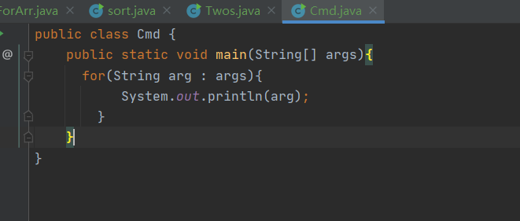
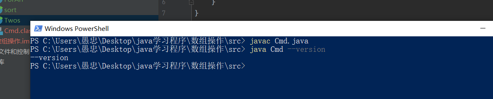

# 数组
## 声明数组
### 一维数组
  java如何声明数组
  java声明数组跟c语言有点相似
  例子：
  ```Java
    int [] 数组名称={数组项1,数组项2};
     
    // 首先先声明数组的类型然后写一个 [] 然后数组的名称= {数组的内容1，数组的内容2}
    String []  //字符串数组
    double []  //双精度数组
    //上面是直接给数组赋值的方式
    int [] a=new int[size];//这种方式声明的数组表示数组的空间是size
  ``` 
### 二维数组
  二维数组的声明方式

```java
  int [][] a={1,{1,2,3}};
  int [][] b=new [size][size];
```
## Arrays工具类
  Arrays里封装了很多操作数组的方法，可以通过Arrays直接调用
```java 
 binarySearch(arr,key) //查找arr数组里的key,查找的原理是通过二分查找
 copyOf(arr,length) //复制arr数组并返回，如果length小于arr的length则是arr的前length个元素
 copyOfRange(arr,start,end); //返回一个新数组，数组内容是arr从start下标到end下标的元素
  equals(arr1,arr2); //遍历两个数组进行比较
  fill(arr,val); //将arr的所有元素都替换为val
  fill(arr,start,end,val); //将arr从start到end的所有元素替换为val
  sort(arr) //对arr进行排序
  toString(arr) //将arr转换为字符串  

  int [] arr1={1,2,6,4};
         int [] arr2={1,2,6,4};
       int [] arr3= Arrays.copyOf(arr1,2);
         System.out.println(Arrays.binarySearch(arr1,6));
         System.out.println(arr3.length);
         System.out.println(Arrays.equals(arr1,arr2));
         Arrays.fill(arr3,9);
         System.out.println(arr3[0]);
```
  高级方法：因为时代的发展程序可以采用并发来进行计算，以提高性能所以有了一些并发的方法用来操作数组
```java
  parallelPrefix(arr,new IntBinaryOperator(){
    // left 代表数组中前一个索引处的元素，计算第一个元素时，left为1
            // right代表数组中当前索引处的元素
            public int applyAsInt(int left, int right) {
                return left * right;
            }
  }) //重新计算数组的方法
   Arrays.parallelSetAll(arr3, new IntUnaryOperator() {
            // operand代表正在计算的元素索引
            public int applyAsInt(int operand) {
                return operand * 5;
            }
        });//重新设置数组的元素
        parallelSort(arr) //利用并发来对数组进行排序
```
## 遍历数组
    我们可以使用for循环或者foreach循环去遍历数组
     可以去github查看Java练习程序->数组操作->src->ForArr
## 数组排序
   我们可以使用冒泡排序对数组进行排序，关于冒泡排序可以自己去研究算法
   也可以引入数组方法sort对数组进行排序
   可以去github查看Java练习程序->数组操作->src->sort
   使用java练习，快排，冒泡，选择排序，归并排序，插入排序，顺序搜索，二分搜索
## 冒泡排序
  冒泡排序的原理是比较两个相邻元素然后移动位置，通过两个for循环进行解决
```java
 Scanner input=new Scanner(System.in);
         double [] arr=new double [5];
         for(int i=0;i<arr.length;i++){
             System.out.print("请输入第"+(i+1)+"个成绩");
             arr[i]=input.nextDouble();
         }
         System.out.println("排序前的顺序是");
         for(double val:arr){
             System.out.print(val+"\t");
         }
         System.out.println();
         for(int j=0;j<arr.length;j++){
             for(int g=0;g<arr.length-1-j;g++){
                 if(arr[g+1] < arr[g]){
                     double temp=arr[g+1];
                     arr[g+1]=arr[g];
                     arr[g]=temp;
                 }
             }
         }
         for(double vals:arr){
             System.out.print(vals+"\t");
         }
```
## 快速排序
  快排的原理就是，进行分区，一般是选择数组的第一个元素作为基准把所有比基准小的元素放进基准前，比基准大的元素放在基准后，然后再递归的对基准前后的子数组进行分区

```java
 public static void quickSort(int [] arr,int low,int high){
        if(low<high){
            int mid=getMiddle(arr,low,high);
            //通过递归对分区完再进行排序
            quickSort(arr,low,mid-1);
            quickSort(arr,mid+1,high);
        }

    }
   public static  int getMiddle(int [] arr,int low ,int high){
        int tmp=arr[low]; //数组的第一个值作为基准
       //找到值在中间的索引，然后将小于基准的放左边，大于基准的放右边
        while(low<high){
            while(low < high && arr[high]>tmp){
                high--;
            }
            arr[low]=arr[high];
            while(low < high && arr[low]<tmp){
                low++;
            }
            arr[high]=arr[low];

        }
        arr[low]=tmp;
        return low;
    }
```
## 选择排序
  选择排序就是找到数组中的最大(最小)值放在第一位，接着找第二小的值放在第二位，一次类推整形n-1轮
```java
public static void selectSort(int [] arr){
        for(int i=0;i<arr.length-1;i++){
            int minIndex=i;//(假设数组的第一项为最小值)
            for(int j=i;j<arr.length;j++){
                if(arr[minIndex] > arr[j]){
                    minIndex=j;
                }
            }
            if(minIndex != i){
                 int tmp=arr[i];
                 arr[i]=arr[minIndex];
                 arr[minIndex]=tmp;
            }
        }
    }
```
## 插入排序
插入排序，就是从数组的第二个元素开始往前比有比他大的就往后排，一次类推到最后一个数
```java
  public static void insertSort(int [] arr){
        for(int i=1;i<arr.length;i++){
             int j=i;
             int temp=arr[i];
             while(j>0){
                 if(arr[j-1] > temp){
                     arr[j]=arr[j-1];
                 }else{
                     break;
                 }
               j--;
             }
            arr[j]=temp;
        }
    }
```
## 多维数组
  多维数组也就是数组里边有多个数组

```Java
    int [][] TwosArr={
        {}
    }
    //这种形式就是多维数组

```
可以去github查看Java练习程序->数组操作->src->Twos
## 命令行参数
   java可以接收一个命令行行参数，这个命令行参数就是我们的main函数的参数String[] args，这个参数是一个字符串

 这个命令行参数就是再我们去编译完我们的java文件的时候，然后再去执行该文件编译成的类的时候， 再后边写的东西


# 字符串
 ## 定义字符串
 ```java
  String str="Hello Java"
  // 先声明变量后复制
  String str
  str="Hello World"
```
 ## String 类
   每一个用双引号包裹的字符都属于Sring类的对象所有我们可以使用String类的构造函数来创建字符串

```java
  //String类
        String str=new String(); //创建一个空字符
        char a[]={'H','e','l','l','0'};
        String strA=new String(a); // 将数组转换为字符串
        String strB=new String(a,1,4); //从数组下标为1 的地方 转换为字符串
         System.out.print(str);
         System.out.print(strA);
         System.out.print(strB);
```
 ## 字符串整型互转
   字符串转整型需要调用Integer类,通过parseInt或者valueof(str).intValue()转换
```Java
//字符串转整型
 String str="123";
 int n,m
 n=Integer.parseInt(str);
 m=Integer.valueOf(str).intValue();
 System.out.println("parseInt:"+n);
 System.out.println("valueOf().intValue()"+m);
 //整型转字符串
        int num=120;
        String str_1=Integer.toString(num);
        String str_2=""+num;
        String str_3=String.valueOf(num);
        System.out.println(str_1);
        System.out.println(str_2);
        System.out.println(str_3);
```
## 拼接字符串
拼接字符串可以使用+或者concat方法
```Java
   String name="小明";
   int age=18;
   String agean="男";
   System.out.println("用户名称:"+name+"年龄"+age+"性别"+agean);
   System.out.println(name.concat(agean));
```
## 获取字符串长度
 依旧使用length方法
```java
 String pass="user";
 System.out.println(pass.length());
```
## 转换字母大小写
toLowerCase()  将所有的字母转换成小写
toUpperCase()   将所有的字母转换成大写
```java
 String s="abE";
 System.out.println(s.toLowerCase());
 System.out.println(s.toUpperCase());
```
## 去除首尾空格
通过trim方法去除空格
```java
 String s=" Hello ";
 System.out.println(s.trim())
```
## 截取字符串
substring(index) 从index截取到结束
substring(start,end) 从start截取到end
```java
 String s="You Love Java";
         System.out.println(s.substring(3));
         System.out.println(s.substring(0,3));
```
## 切割字符串
split(指定字符,切割的个数) 方法进行切割
```java
String s="1,11,111,1111,11111";
String[] s_arr=s.split(",");
for(int i=0;i<s_arr.length;i++){
System.out.println(s_arr);
}
```
## 替换字符
replace(目标字符串，替换字符串); 
replaceFirst(目标字符串,替换字符串);
replaceAll(目标字符串,替换字符串);
```java
  String s="Hello Java Hello Php";
        System.out.println(s.replace("Hello","你好"));
        System.out.println(s.replaceFirst("Hello","你好"));
        System.out.println(s.replaceAll("Hello","你好"));
```
## 比较字符串
 equals 遍历字符串进行比较，不区分大小写
 equalsIgnoreCase 遍历字符串进行比较，区分大小写
 compareTo 比较字符穿线的先后顺序
## 查找字符串
  indexOf(str,index) 从前往后找返回下标
  lastindexOf(str,index) 从后往前找，找到返回下标，
  以上两个方法如果都指定下标则从指定的下标开始找
```java
String s_List="ertuacaaqwejauqa";
         int s=s_List.indexOf("a",5);
         int a=s_List.lastIndexOf("a");
         System.out.println(a);
```
## StringBuffer类
 new StringBuffer() 构建一个空的字符串缓冲区，默认是16个字符的容量
 new StringBUffer(length) 构建一个空的字符串缓冲区，容量是length
 new StringBuffer(str) 构建一个16+str.lengt容量的字符串缓冲区，里边有str字符
 append(str) 追加字符
 setCharAt(index,str) 替换字符
 reverse 反转字符串
 deleCharAt(index) 删除指定index的字符
 delete(start,end) 删除从start到end的字符串
```java
Stringbuffer str =new StringBuffer();
str.append('H'); //str = "H"
str.append('e'); // str="e"
str.append('l'); // str="l"
str.append('l'); // str="l"
str.append('0'); // str ="o"
str.setCharAt(1,'E'); //str ="HEllo";
str.deteCharAt(1);//str ="Hllo"
str.delete(0,1); //str="llo"
str.reverse() // str="llo"
```
操作少量的数据使用 String。
单线程操作大量数据使用 StringBuilder。
多线程操作大量数据使用 StringBuffer。