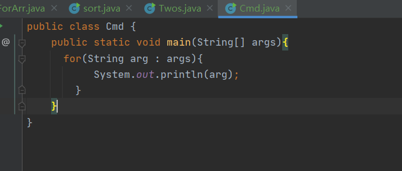

# 声明数组
  java如何去声明数组
  java声明数组跟c语言有有点相似
  例子：
  ```Java
    int [] 数组名称={数组项1,数组项2};

    // 首先先声明数组的类型然后写一个 [] 然后数组的名称= {数组的内容1，数组的内容2}
  ```
  # 遍历数组
    我们可以使用for循环或者foreach循环去遍历数组
     可以去github查看Java练习程序->数组操作->src->ForArr
 # 数组排序
   我们可以使用冒泡排序对数组进行排序，关于冒泡排序可以自己去研究算法
   也可以引入数组方法sort对数组进行排序
   可以去github查看Java练习程序->数组操作->src->sort

# 多维数组
  多维数组也就是数组里边有多个数组

```Java
    int [][] TwosArr={
        {}
    }
    //这种形式就是多维数组

```
可以去github查看Java练习程序->数组操作->src->Twos
# 命令行参数
   java可以接收一个命令行行参数，这个命令行参数就是我们的main函数的参数String[] args，这个参数是一个字符串

 这个命令行参数就是再我们去编译完我们的java文件的时候，然后再去执行该文件编译成的类的时候， 再后边写的东西
