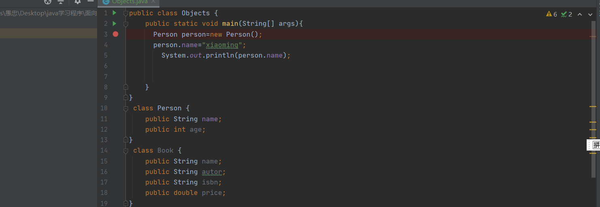
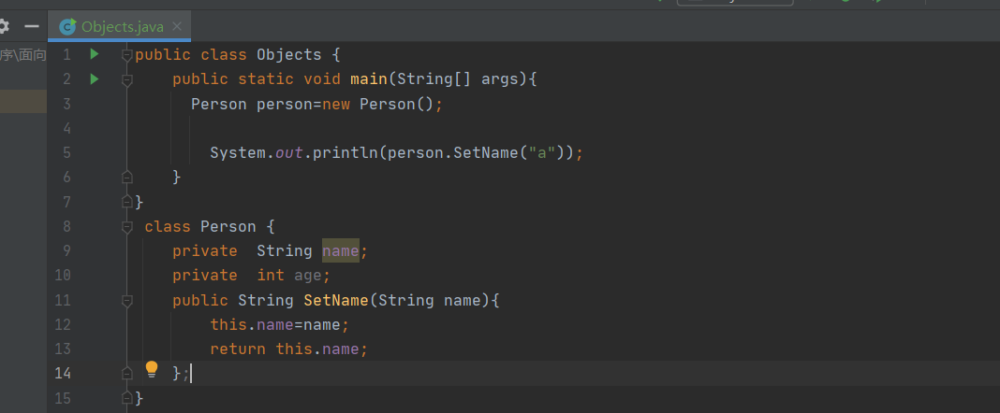
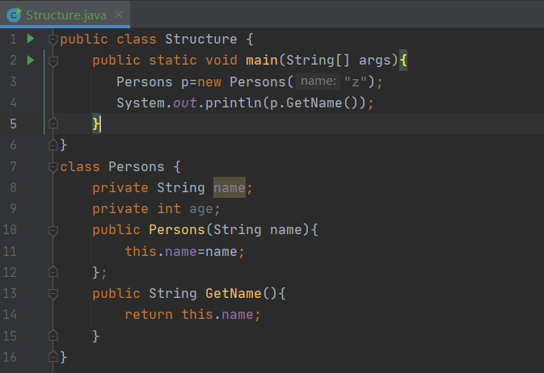
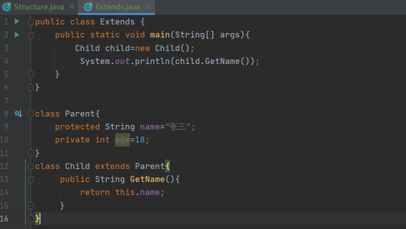

# 面向对象
  我们的js是面向过程的语言，但是java是面向对象的语言，面向对象就有了以下比如：类，实例，方法，继承，多态。
# 声明对象，且使用对象的例子
 
  
  像上图那种，我们直接把数据public 暴漏给公共的，然后直接去对象实例化，然后再对象里的数据进行修改，这样会造成逻辑混乱，所以我们需要给我们的对象里边加上private  修饰符，拒绝外部去进行访问修改，然后我们可以暴漏出去一个方法通过调用方法来进行间接修改我们的对象里边的数据，这样我们就可以再方法里边对数据进行判断然后再去赋值给我们的对象内部的变量。
   例子:
   

# 构造方法
   像上面的两个例子，我们都是在对我们的对象实例化后，再调用该对象里边的方法去进行对该对象里边的变量进行初始化赋值，这样很不方便，所以我们就有了构造方法来在对对象进行实例化的时候就传入参数然后对该对象里的数据进行初始化赋值
   例子:
  

# 继承
 关于java中的继承我们可以参考Js的构造函数的继承，在Js的es6里我们同样使用class去定义对象，用extends来继承对象，在java里我们同样使用extends来进行继承
 例子:

 
 在图片代码里我们有一个新的关键字,protected 这个关键字的作用是我们在父亲对象里边的数据可以被儿子对象访问到，我们如果使用private关键字儿子对象则访问不到父亲对象里边的数据

## 继承的子类使用父类的构造方法
   如果我们的子类想要使用父类的构造方法那么需要在我们的子类里加一个super()函数的调用，如果父类没有自己默认的构造方法那么我们是继承不了的
## 继承的限制(阻止继承)
   我们可以在我们父类的class关键字前加上sealed关键字以及在父类的类名后加上一个permits关键字，后边跟上我们允许继承的类的类名，这样就只有我们允许的类可以继承该类
   
    例子:
  
  
这个组织继承日后研究深刻了，将会重新写
