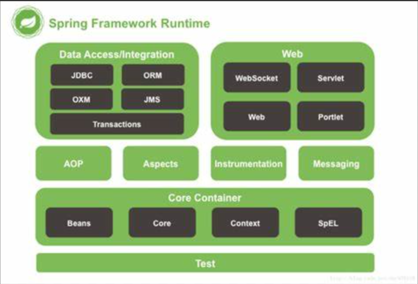
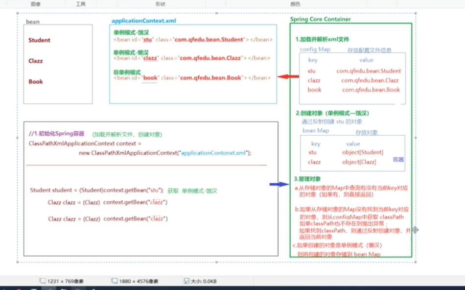

# 初识Spring
 Spring是分层的(控制层/业务层/数据访问层) 对每一层都提供了技术支持。以Ioc(控制反转，可以看IOC设计模式)和Aop(面向切面编程)为内核。

 Spring实际上是一个大容器，包含了开发java程序所需的各种技术。


 用来解决企业级项目开发的复杂度问题-解耦

 特点:
   轻量级，体积小，对代码没有侵入性
   
   控制反转(IoC  Inverse  of Control) 把创建对象的工作交给Spring,Spring在创建对象的时候同
   时可以完成对象属性赋值(DI----依赖注入)

   面向切面编程(Aop Aspect oriented Programming): 可以在不改变原有逻辑的情况下，实现对业务的增强

   容器 Spring不仅可以创建对象，还可以进行存储对象，管理创建的对象
 ## web项目开发中的耦合度问题

  在Servlet中需要调用service的方法，需要在Servlet类中进行Service实例

  在Service中需要调用dao实现类，需要在Service类中进行Service实例

   如果使用new 关键字创建对象
      失去了面向接口编程的灵活性
      代码的侵入性增强(增加了耦合度)，降低了代码的灵活性

      解决方案:在Servlet中定义接口的对象变量，不使用new关键字创建实现类对象，在Servlet的实例化的时候，通过反射动态的给Service对象变量赋值。

      如何实现:Spring框架

## Spring的体系架构
  Spring Boot 工具框架，快速的整合项目

  Spring Framework (Ioc,Aop)

  Spring Data Spring提供的数据访问的客户端(数据库 jpa,redis)

  Spring Cloud 微服务架构

  Spring Security 安全框架



### core Container (核心组件)

Spring容器组件，用于完成实例的创建和管理

Core 核心

Beans 实例管理(依赖于Core)

Context spring上下文(容器上下文)

spEl 表达式组件

### Aop ,Aspects

   Spring Aop 组件 提供了面向切面编程的实现

   aop

   aspects

### web
  spring web组件实际上指的即使spring mva

  web spring对web项目的支持

  webmvc springmvc组件

### Data Access
 spring 数据访问组件，基于jdbc封装的

### Test
 Spring的单元测试组件，提供了spring环境下的端元测试支持

# Spring框架部署(IoC)

   Spring IoC容器组件，可以完成对象的创建，对象属性赋值，对象管理

    创建maven空工程

    添加SpringIoC依赖

        Spring Beans

        Spring Core

        Spring Context
        
        Spring Aop

        Spring expression
        起始添加完依赖之后可以发现，主要添加Context就可以了，其他的因为Context也有依赖所以会进行依赖导入

## 创建Spring配置文件
  
  通过配置文件，告诉Spring容器，创建什么对象，给对象属性赋值

  在resources 目录下创建xml文件 ，通常命名为applicationContext.xml

  在导入包之后，有创建xml模板，选择之后，输入文件名即可

## Spring IoC 的使用
 
    使用Spring IoC 创建并管理对象

    首先需要创建一个实体类
```java
package org.example;

public class Student {
    private String name;
    private String sex;
    private int age;

    public String getName() {
        return name;
    }

    public void setName(String name) {
        this.name = name;
    }

    public String getSex() {
        return sex;
    }

    public void setSex(String sex) {
        this.sex = sex;
    }

    public int getAge() {
        return age;
    }

    public void setAge(int age) {
        this.age = age;
    }

    @Override
    public String toString() {
        return "Student{" +
                "name='" + name + '\'' +
                ", sex='" + sex + '\'' +
                ", age=" + age +
                '}';
    }
}
```

 创建完成实体类之后，先来看一下传统的创建对象的方式

 ```java
public class Main {
    public static void main(String[] args) {
/*
*  传统创建对象的方式，如果需要修改学生信息的话就需要改动代码
*  */
     Student stu1=new Student();
        stu1.setAge(18);
        stu1.setName("张三");
        stu1.setSex("女");
        System.out.println(stu1);
    }
}
 ```

 使用SpringIoC创建对象和管理对象

  首先需要配置Spring的配置文件

```xml
<?xml version="1.0" encoding="UTF-8"?>
<beans xmlns="http://www.springframework.org/schema/beans"
       xmlns:xsi="http://www.w3.org/2001/XMLSchema-instance"
       xsi:schemaLocation="http://www.springframework.org/schema/beans http://www.springframework.org/schema/beans/spring-beans.xsd">
       <!-- id 是这个类名称  class是这个类的路径 -->
     <bean id="Studnet" class="org.example.Student">
       <!-- name 就是属性名 value就是属性值 -->
       <property name="age" value="21"></property>
         <property name="name" value="张三"></property>
         <property name="sex" value="女"></property>
         </bean>

</beans>
```
使用Spring创建对象
```java

public class Main {
    //可以看到，当需要去改动的时候并不需要去改动代码，只需要改动配置文件
    public static void main(String[] args) {
        //创建Spring容器
        ClassPathXmlApplicationContext context=new ClassPathXmlApplicationContext("applicationContext.xml");
        //创建Student对象
         Student stu1=(Student) context.getBean("stu");
        System.out.println(stu1);
    }
}
```
## IoC和DI

  IoC (Inverse of Contorl) 控制反转，通过Spring对象工厂完成对象的创建

  DI (Dependency Injection) 依赖注入，在Spring完成对象的创建的同时，依赖Spring完成对象属性的赋值

### IoC
  当我们需要通过Spring对象工厂创建某个类的对象的时候，需要将这个类交给bean标签配置

### 依赖注入
    通过Spring容器给创建的对象属性赋值
    Spring加载配置文件之后，通过创建类的都对象，并给属性赋值

    Spring容器通过反射实现属性注入有三种方式

    set方法注入

    构造器注入

    接口注入

 ```java

public class Main {
    public  static void main (){
        /**
        
        当我们去创建Spring容器的时候，Spring的源码里会去进行解析配置文件
        解析配置文件通过反射去帮助我们创建对象和给属性赋值
        */

// 配置文件


//简单实现

String calssPath="org.example.Student";
Class c=Class.forName(calssPath); 
//创建对象
Object obj=c.newInstans();

//获取类中的属性

Field[] fields=c.getDeclaredFields();

/**
给属性赋值
解析配置文件里的Property
通过name 获取到属性的set方法
在拿到配置文件里的value 进行赋值
 */
    }}
 ```
 #### set方法注入
   在bean标签中，通过配置property标签就是通过set方法注入

```xml

 <bean id="Studnet" class="org.example.Student">
  <property name="age" value="21"></property>
         </bean>
```
 简单类型及字符串，直接通过propery的value属性赋值

##### 引用类型赋值

 ```xml
 <!-- 

    方式1
    在配置文件里通过bean 创建引用类型的类，
    然后通过propery标签的ref属性绑定引用类型的bean 的id
  -->
<bean id="date" class="java.util.Date"></bean>
     <bean id="stu" class="org.example.Student">
         <constructor-arg ref="environment"/>
         <property name="age" value="21"></property>
         <property name="name" value="张三"></property>
         <property name="sex" value="女"></property>
         <property name="date" ref="date"></property>
     </bean>

     <!-- 

        方式2,在propery标签内，直接写bean
      -->
       <bean id="stu" class="org.example.Student">
         <constructor-arg ref="environment"/>
         <property name="age" value="21"></property>
         <property name="name" value="张三"></property>
         <property name="sex" value="女"></property>
         <property name="date">
             <bean class="java.util.Date"></bean>
         </property>
     </bean>
 ```

##### 集合类型
 
######  List
引用类型
 ```xml
 <!-- 第一种方式 -->
 <property name="date">
 <list>
  <bean class="java.util.Date"></bean>
 </list>
</property>
<!-- 第二种方式 -->
<property name="date">
<list>
 <ref bean="bean的id"></ref>
</list>
</property>
 ```
###### set

```xml
<!-- set的方式和list一样 -->

```
###### map

```xml
<property>
  <map>
    <Entry>
      <key>
        <!-- 如果key为普通类型使用value -->
        <value></value>
        <!-- 如果key为引用类型，使用bean -->
        <bean></bean>
      </key>
      <!-- 如果value是普通类型使用value -->
      <value></value>
      <!-- 如果value为引用类型，使用bean -->
      <bean></bean>
    </Entry>
  </map>
</property>
```
#### 构造器注入

构造器注入，是和set注入的xml写法是一样的，只不过是将property替换为constructor-arg

```xml
<!-- 
  
  index属于可选属性，constructor-arg的顺序和有参构造的顺序是一样的
  如果顺序不一样，使用index属性区分有参构造中参数的顺序

 -->
<constructor-arg name="属性名" index="0"></constructor-arg>
```
### Bean的作用域
  在bean标签，使用scope可以设置Bean的作用域，
    scope="singleton" 单例模式 (默认是饿汉模式，对象没有使用即创建，使用lazy-init="true" 是懒汉模式，对象使用才被创建赋值)

    scope="prototype" 非单例模式

```xml
<!-- 单例，饿汉模式 -->
<bean class="com.org.Student" scope="singleton"></bean>
<!-- 单例，懒汉模式 -->
<bean class="com.org.Student" scope="singletion" lazy-init="true"></bean>
<!-- 非单例模式 -->
<bean class="com.org.Student" scop="prototype"></bean>
```

### Bean的声明周期

  init-method 对象创建之后立即调用

  destory-method 指定销毁方法

```xml
 <bean id="stu" class="org.example.Student" init-method="init" destroy-method="destory"> 
```

```java
/**
  在使用Spring创建对象的时候，如果在配置文件里指定了init方法，那么会调用init方法(destory同理)
 */
public class Student {
    public Student(Environment environment) {
    }
    public void init(){
        System.out.println("我是init方法");
    }
    public void destory(){
        System.out.println("我是destory方法");
    }
}
```
### Spring-IoC-自动装配

  自动装配，Spring容器在实例化当前bean的时候会从容器内找到匹配到的实例赋值给当前bean的属性

  自动装配策略有两种:
     byName: 根据bean的id找到匹配的对象，但是如果找到了但是类型不同会报错

     byType: 根据类型找到匹配的对象，但是如果找到多个就会报错

```xml
   <!-- byName -->
     <bean id="stu" class="org.example.Student" autowire="byName">
     <!-- byType -->
      <bean id="stu" class="org.example.Student" autowire="byType">
```
### Spring-IoC的工作原理

 


## SpringIoC 基于注解
 SpringIoC的使用需要我们通过xml文件将类声明给Spring容器管理，从而通过Spring工厂完成对象的创建和属性的赋值。

 Spring除了提供基于xml的配置方式，同时及提供了基于注解的配置，直接在实体类中添加注解声明给Spring容器管理，以便简化开发步骤

### 基于注解的框架部署
 
      
         1、创建空maven项目
         2、导入spring-context依赖
      
### 创建Spring配置文件

```xml
<?xml version="1.0" encoding="UTF-8"?>
<beans xmlns="http://www.springframework.org/schema/beans"
       xmlns:xsi="http://www.w3.org/2001/XMLSchema-instance"
       xmlns:context="http://www.springframework.org/schema/context"
       xsi:schemaLocation="http://www.springframework.org/schema/beans
       http://www.springframework.org/schema/beans/spring-beans.xsd
       http://www.springframework.org/schema/context
       http://www.springframework.org/schema/context/spring-context.xsd">
    <!--   声明使用注解配置-->

    <context:annotation-config></context:annotation-config>
    <!--    声明Spring容器扫描范围-->
    <context:component-scan base-package="包名"></context:component-scan>
</beans>
```
### SpringIoC常用注解

#### @Component
  类注解，用于声明此类被Spring容器管理，相当于xml中的bean标签
 
  @Compent(value="stu") value属性就相当于bean标签的id属性，这个value属性可以省略，如果省略则是类名的首字母小写
```java
/**
   Student实体类
 */
import org.springframework.stereotype.Component;

@Component(value="stu")
public class Student {
    private int id;
    private String name;
    private String sex;

    public Student() {
    }

    public int getId() {
        return id;
    }

    public void setId(int id) {
        this.id = id;
    }

    public String getName() {
        return name;
    }

    public void setName(String name) {
        this.name = name;
    }

    public String getSex() {
        return sex;
    }

    public void setSex(String sex) {
        this.sex = sex;
    }
}


/**
 Main函数
 */
 public class Main {
    public static void main(String[] args) {
       ClassPathXmlApplicationContext context=new ClassPathXmlApplicationContext("applicationContext.xml");
       Student stu=(Student) context.getBean("stu");
        System.out.println(stu);
    }
}
```

  
              除了@Component之外@Service @Contorller @Repository这三个注解也可以将类叫给Spring管理，它们主要是予以上的区别:
                  
                     @Service 主要用于将业务类交给Spring管理，比如Service类

                     @Controller 主要用于将Controller层的类交给Spring管理，比如:Servlet

                     @Repository 主要用于将Dao层的接口交给Spring管理，比如Dao层的接口

#### @scope

想当于Bean标签的scope属性 

 类注解

  有两个值 prototype 表示 非单例模式(默认单例模式)

  singleton  单例模式

#### @Lazy 
 
   类注解，用于声明一个单例模式的Bean是否为懒汉模式

   @Lazy表示声明为懒汉模式，默认为饿汉模式

#### PostConstruct

 方法注解

   声明一个方法为当前类的初始化方法(在构造器之后调用)，相当于bean标签的init-method属性

#### @PreDestory

   方法注解

    声明一个方法为当前类的销毁方法(在对象销毁之前调用)，相当于bean标签的destory-method属性

```java
public class Student {
   ...
    @PostConstruct()
    public void init(){
        System.out.println("我是init方法");
    }
    @PreDestroy()
    public void destory(){
        
    }
}
```


```xml
<!-- 如果使用PreDestory注解和PostConstruct报红的话，那么pom依赖文件需要加入 -->
  <dependency>
            <groupId>javax.annotation</groupId>
            <artifactId>jsr250-api</artifactId>
            <version>1.0</version>
        </dependency>
```
#### 自动装配注解
 自动装配注解有两个@Autowired 和@Resource 

##### Autowited

   属性注解 方法注解(set方法) 声明当前属性自动装配 ，默认是byType，找到多个匹配类型抛出异常，如果没有找到类型与属性类型匹配的bean则抛出异常，@Autowired(required=false) 如果没有找到类型匹配的则设置为null不抛出异常

```java
public class Student {
    ....
    private Clazz clazz;

    public Clazz getClazz() {
        return clazz;
    }
    @Autowired(required = false)
    public void setClazz(Clazz clazz) {
        this.clazz = clazz;
    }
}
```
 byType的方法去找bean的话如果有多个同类型的会抛出异常，所以接下来看是使用ByName的方式

 ```java
@Controller(value="stu")
public class Student {
    ...
    private Clazz clazz;

    public Clazz getClazz() {
        return clazz;
    }
    /**
       通过使用@Qualifier的方式，根据名字找到对应的bean
     */
    @Autowired(required = false)
    public void setClazz(@Qualifier("c1") Clazz clazz) {
        this.clazz = clazz;
    }
}
 ```

 ##### Resource


   属性注解，用于声明属性自动装配

   默认装配方式为byName，根据byName找到如果类型不匹配则抛出异常，如果根据byName没有找到，则根据byType去进行查找，如果byType没有找到或者找到多个则抛出异常

  ```java
public class Student {
  ...
    @Resource
    private Clazz clazz;
}
  ```

  使用@Resource注解，需要导入依赖包

```xml
 <!--@Resource pom 依赖-->
  <dependency>
            <groupId>javax.annotation</groupId>
            <artifactId>javax.annotation-api</artifactId>
            <version>1.3.2</version>
        </dependency>
```

## AOP代理设计模式

代理其实就是将重复的工作交给代理完成

### 生活中的代理

 代理其实就相当于中介:比如租房 有房客，房东，中介三个对象

 房东只负责收钱和签合同，中介负责宣传房子了解房源帮助房客处理所有入住的问题，房客通过广告跟房东签署合同。

 中介就相当于是代理，将重复的工作交给代理坐，房客只负责掏钱租房，房东只负责收钱和签署合同


### 代理设计模式的有事

 将通用性的工作都交给代理对象完成，被代理对象只专注自己的核心业务

 ### 代理的分类

   代理分为：静态代理和动态代理

#### 静态代理

代理类，只能为特定的类生产代理对象，不能生产任意类

```java
// DEMO

//Dao层的Student类和Book类

public class BookDao implements Grade {
    @Override
    public void insert() {
            System.out.println("书籍插入操作");
    }
    @Override
    public void update() {
        System.out.println("书籍修改操作");
    }
    @Override
    public void delete() {
        System.out.println("书籍删除操作");
    }
}


public class StudentDao implements Grade {
    @Override
    public void insert() {
            System.out.println("学生插入操作");
    }
    @Override
    public void update() {
        System.out.println("学生修改操作");
    }
    @Override
    public void delete() {
        System.out.println("学生删除操作");
    }
}

//接口

public interface Grade {
    public void insert();
    public void update();
    public void delete();
}

//代理实现类
public class MyStaticProxy {
    private Grade grade;
    public MyStaticProxy(Grade grade) {
        this.grade = grade;
    }
    public void insert(){

    this.open();
        grade.insert();
    this.commit();
}
    public void update(){
        this.open();
        grade.update();
       this.commit();
    }
    public void delete(){
        this.open();
        grade.delete();
        this.commit();
    }
    public void open(){
        System.out.println("开启事务");
    }
    public void commit(){
        System.out.println("提交事务");
    }
}

//测试类

public class Test {
    public static void main(String[] args) {
        MyStaticProxy proxy=new MyStaticProxy(new StudentDao());
        proxy.insert();
    }
}

```

使用代理的好处：被代理类中只关注核心业务的实现，将通用的管理逻辑(事务管理，日志管理)和业务逻辑分离。将通用的代码放在代理类中实现，提供了代码的复用性。通过在代理类添加业务逻辑，实现对业务逻辑的扩展(增强)。

#### JDK动态代理

动态代理，几乎可以为所有的类产生代理方式

  动态代理的方式有两种

     JDK动态代理

     CGLib 动态代理

#### JDK动态代理

 JDK动态代理，是通过被代理对象实现的接口，产生其代理对象


 使用JDK动态代理需要实现InvocationHandler

 创建一个类，实现InvocationHandler接口，重写invoke方法

 在类中定义一个Object类型的变量，并提供这个变量的有参构造器，用于将代理对象传递尽力啊

 定义getProxy方法，用于创建并返回代理对象


 ```java

//JDK动态代理类实现
public class JdkProxy implements InvocationHandler {
    private Object obj;

    public JdkProxy(Object obj) {
        this.obj = obj;
    }

    public Object getProxy(){
        //获取被代理对象的类加载器
        ClassLoader classLoader = obj.getClass().getClassLoader();
        //找到被代理对象实现的接口
        Class<?>[] interfaces=obj.getClass().getInterfaces();
        //通过类加载器和 实现的接口创建代理对象
        //第一个参数  被代理对象的类加载器
        //第二个参数 被代理对象实现的接口
        //第三个参数 InvocationHandler类 (因为当前类实现了InvocationHandler接口所以直接传this就可以了)
        Object proxy=Proxy.newProxyInstance(classLoader,interfaces,this);
        return proxy;
    }
    @Override
    public Object invoke(Object proxy, Method method, Object[] args) throws Throwable {
        this.begin();
        method.invoke(obj); //执行method方法
        this.commit();
        return null;
    }
    public void begin(){
        System.out.println("开启事务");
    }
    public void commit(){
        System.out.println("提交了事务");
    }
}

//Test

public class Test {
    public static void main(String[] args) {
        //创建被代理对象
        BookDao bookDao = new BookDao();
        //创建代理
        JdkProxy proxy= new JdkProxy(bookDao);
        //创建代理对象，代理对象可以强转换为被代理对象实现的接口类型
        Grade o= (Grade)proxy.getProxy();
        //使用被代理对象调用方法时不会直接进入方法，而是进入到InvaInvocationHandler的invoke方法
        //调用的方法作为一个参数传递给了invoke方法
        o.insert();
    }
}
 ```

 #### CGLib动态代理

 因为JDK动态代理是通过被代理类实现的接口来创建代理对象的，因此JDK动态代理只能代理实现了接口类的对象，如果一个类没有实现任何接口，该如何产生代理对象，

 CGLib动态代理，是通过创建被代理类的子类，因此没有实现任何接口的类也可以通过CGLib产生代理对象


 cglib不能为final创建代理对象

     1.添加cglib依赖
     2.创建一个类，实现MethodInterceptor接口，同时实现接口中的Intercept方法
     3.在类中定义一个Object类型的变量，并提供这个类型的有参构造器，用于传递被代理对象
     3.定义getProxy方法创建并返回代理对象

```java
//CGLib动态代理类实现
public class CGLibProxy implements MethodInterceptor {
   private Object obj;

    public CGLibProxy() {
    }

    public CGLibProxy(Object obj) {
        this.obj = obj;
    }

    public Object getProxy(){
       Enhancer enhancer=new Enhancer();
        enhancer.setSuperclass(obj.getClass());
        enhancer.setCallback(this);
        Object proxy=enhancer.create();
        return new Object();
    }
    //相当于jdk代理的invoke方法
    @Override
    public Object intercept(Object o, Method method, Object[] objects, MethodProxy methodProxy) throws Throwable {
        this.begin();
        //objects是参数
        Object returnValue=method.invoke(obj,objects);
        this.commit();
        return returnValue;
    }
    public void begin(){
        System.out.println("开启事务");
    }
    public void commit(){
        System.out.println("提交事务");
    }
}


//Test

public class Test {
    public static void main(String[] args) {
        //创建被代理对象
        BookDao bookDao = new BookDao();
        //创建代理
        CGLibProxy cgLibProxy=new CGLibProxy(bookDao);
        Object obj=cgLibProxy.getProxy();
        //代理对象实际上是实现了被代理对象的子类
       BookDao proxy=(BookDao)cgLibProxy.getProxy();
       //执行方法，实际上是到了代理类的intercept方法
       proxy.insert();
    }
}

```