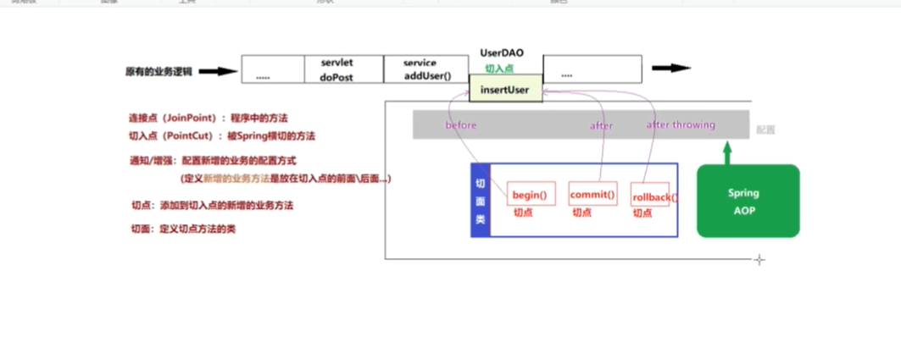
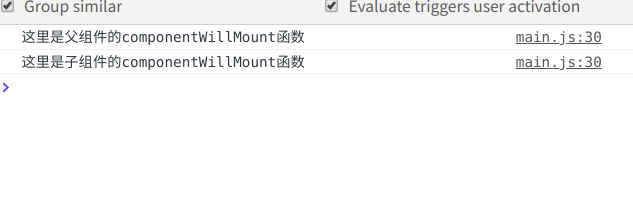

# 初识Spring
 Spring是分层的(控制层/业务层/数据访问层) 对每一层都提供了技术支持。以Ioc(控制反转，可以看IOC设计模式)和Aop(面向切面编程)为内核。

 Spring实际上是一个大容器，包含了开发java程序所需的各种技术。


 用来解决企业级项目开发的复杂度问题-解耦

 特点:
   轻量级，体积小，对代码没有侵入性
   
   控制反转(IoC  Inverse  of Control) 把创建对象的工作交给Spring,Spring在创建对象的时候同
   时可以完成对象属性赋值(DI----依赖注入)

   面向切面编程(Aop Aspect oriented Programming): 可以在不改变原有逻辑的情况下，实现对业务的增强

   容器 Spring不仅可以创建对象，还可以进行存储对象，管理创建的对象
 ## web项目开发中的耦合度问题

  在Servlet中需要调用service的方法，需要在Servlet类中进行Service实例

  在Service中需要调用dao实现类，需要在Service类中进行Service实例

   如果使用new 关键字创建对象
      失去了面向接口编程的灵活性
      代码的侵入性增强(增加了耦合度)，降低了代码的灵活性

      解决方案:在Servlet中定义接口的对象变量，不使用new关键字创建实现类对象，在Servlet的实例化的时候，通过反射动态的给Service对象变量赋值。

      如何实现:Spring框架

## Spring的体系架构
  Spring Boot 工具框架，快速的整合项目

  Spring Framework (Ioc,Aop)

  Spring Data Spring提供的数据访问的客户端(数据库 jpa,redis)

  Spring Cloud 微服务架构

  Spring Security 安全框架


### core Container (核心组件)

Spring容器组件，用于完成实例的创建和管理

Core 核心

Beans 实例管理(依赖于Core)

Context spring上下文(容器上下文)

spEl 表达式组件

### Aop ,Aspects

   Spring Aop 组件 提供了面向切面编程的实现

   aop

   aspects

### web
  spring web组件实际上指的即使spring mva

  web spring对web项目的支持

  webmvc springmvc组件

### Data Access
 spring 数据访问组件，基于jdbc封装的

### Test
 Spring的单元测试组件，提供了spring环境下的端元测试支持

# Spring框架部署(IoC)

   Spring IoC容器组件，可以完成对象的创建，对象属性赋值，对象管理

    创建maven空工程

    添加SpringIoC依赖

        Spring Beans

        Spring Core

        Spring Context
        
        Spring Aop

        Spring expression
        起始添加完依赖之后可以发现，主要添加Context就可以了，其他的因为Context也有依赖所以会进行依赖导入

## 创建Spring配置文件
  
  通过配置文件，告诉Spring容器，创建什么对象，给对象属性赋值

  在resources 目录下创建xml文件 ，通常命名为applicationContext.xml

  在导入包之后，有创建xml模板，选择之后，输入文件名即可

## Spring IoC 的使用
 
    使用Spring IoC 创建并管理对象

    首先需要创建一个实体类
```java
package org.example;

public class Student {
    private String name;
    private String sex;
    private int age;

    public String getName() {
        return name;
    }

    public void setName(String name) {
        this.name = name;
    }

    public String getSex() {
        return sex;
    }

    public void setSex(String sex) {
        this.sex = sex;
    }

    public int getAge() {
        return age;
    }

    public void setAge(int age) {
        this.age = age;
    }

    @Override
    public String toString() {
        return "Student{" +
                "name='" + name + '\'' +
                ", sex='" + sex + '\'' +
                ", age=" + age +
                '}';
    }
}
```

 创建完成实体类之后，先来看一下传统的创建对象的方式

 ```java
public class Main {
    public static void main(String[] args) {
/*
*  传统创建对象的方式，如果需要修改学生信息的话就需要改动代码
*  */
     Student stu1=new Student();
        stu1.setAge(18);
        stu1.setName("张三");
        stu1.setSex("女");
        System.out.println(stu1);
    }
}
 ```

 使用SpringIoC创建对象和管理对象

  首先需要配置Spring的配置文件

```xml
<?xml version="1.0" encoding="UTF-8"?>
<beans xmlns="http://www.springframework.org/schema/beans"
       xmlns:xsi="http://www.w3.org/2001/XMLSchema-instance"
       xsi:schemaLocation="http://www.springframework.org/schema/beans http://www.springframework.org/schema/beans/spring-beans.xsd">
       <!-- id 是这个类名称  class是这个类的路径 -->
     <bean id="Studnet" class="org.example.Student">
       <!-- name 就是属性名 value就是属性值 -->
       <property name="age" value="21"></property>
         <property name="name" value="张三"></property>
         <property name="sex" value="女"></property>
         </bean>

</beans>
```
使用Spring创建对象
```java

public class Main {
    //可以看到，当需要去改动的时候并不需要去改动代码，只需要改动配置文件
    public static void main(String[] args) {
        //创建Spring容器
        ClassPathXmlApplicationContext context=new ClassPathXmlApplicationContext("applicationContext.xml");
        //创建Student对象
         Student stu1=(Student) context.getBean("stu");
        System.out.println(stu1);
    }
}
```
## IoC和DI

  IoC (Inverse of Contorl) 控制反转，通过Spring对象工厂完成对象的创建

  DI (Dependency Injection) 依赖注入，在Spring完成对象的创建的同时，依赖Spring完成对象属性的赋值

### IoC
  当我们需要通过Spring对象工厂创建某个类的对象的时候，需要将这个类交给bean标签配置

### 依赖注入
    通过Spring容器给创建的对象属性赋值
    Spring加载配置文件之后，通过创建类的都对象，并给属性赋值

    Spring容器通过反射实现属性注入有三种方式

    set方法注入

    构造器注入

    接口注入

 ```java

public class Main {
    public  static void main (){
        /**
        
        当我们去创建Spring容器的时候，Spring的源码里会去进行解析配置文件
        解析配置文件通过反射去帮助我们创建对象和给属性赋值
        */

// 配置文件


//简单实现

String calssPath="org.example.Student";
Class c=Class.forName(calssPath); 
//创建对象
Object obj=c.newInstans();

//获取类中的属性

Field[] fields=c.getDeclaredFields();

/**
给属性赋值
解析配置文件里的Property
通过name 获取到属性的set方法
在拿到配置文件里的value 进行赋值
 */
    }}
 ```
 #### set方法注入
   在bean标签中，通过配置property标签就是通过set方法注入

```xml

 <bean id="Studnet" class="org.example.Student">
  <property name="age" value="21"></property>
         </bean>
```
 简单类型及字符串，直接通过propery的value属性赋值

##### 引用类型赋值

 ```xml
 <!-- 

    方式1
    在配置文件里通过bean 创建引用类型的类，
    然后通过propery标签的ref属性绑定引用类型的bean 的id
  -->
<bean id="date" class="java.util.Date"></bean>
     <bean id="stu" class="org.example.Student">
         <constructor-arg ref="environment"/>
         <property name="age" value="21"></property>
         <property name="name" value="张三"></property>
         <property name="sex" value="女"></property>
         <property name="date" ref="date"></property>
     </bean>

     <!-- 

        方式2,在propery标签内，直接写bean
      -->
       <bean id="stu" class="org.example.Student">
         <constructor-arg ref="environment"/>
         <property name="age" value="21"></property>
         <property name="name" value="张三"></property>
         <property name="sex" value="女"></property>
         <property name="date">
             <bean class="java.util.Date"></bean>
         </property>
     </bean>
 ```

##### 集合类型
 
######  List
引用类型
 ```xml
 <!-- 第一种方式 -->
 <property name="date">
 <list>
  <bean class="java.util.Date"></bean>
 </list>
</property>
<!-- 第二种方式 -->
<property name="date">
<list>
 <ref bean="bean的id"></ref>
</list>
</property>
 ```
###### set

```xml
<!-- set的方式和list一样 -->

```
###### map

```xml
<property>
  <map>
    <Entry>
      <key>
        <!-- 如果key为普通类型使用value -->
        <value></value>
        <!-- 如果key为引用类型，使用bean -->
        <bean></bean>
      </key>
      <!-- 如果value是普通类型使用value -->
      <value></value>
      <!-- 如果value为引用类型，使用bean -->
      <bean></bean>
    </Entry>
  </map>
</property>
```
#### 构造器注入

构造器注入，是和set注入的xml写法是一样的，只不过是将property替换为constructor-arg

```xml
<!-- 
  
  index属于可选属性，constructor-arg的顺序和有参构造的顺序是一样的
  如果顺序不一样，使用index属性区分有参构造中参数的顺序

 -->
<constructor-arg name="属性名" index="0"></constructor-arg>
```
#### p空间赋值
 
 因为给bean赋值，需要写很多property标签，所以有了p空间配置，来简化bean的属性赋值
```xml

```
### Bean的作用域
  在bean标签，使用scope可以设置Bean的作用域，
    scope="singleton" 单例模式 (默认是饿汉模式，对象没有使用即创建，使用lazy-init="true" 是懒汉模式，对象使用才被创建赋值)

    scope="prototype" 非单例模式

    scope="request" getBean每次获取的对象，在同一个请求范围内使用，如果产生新请求，则新请求中获取bean，重新创建对象

    scope="session"  在同一个会话中获取同一个bean为相同对象，新会话中重新创建

    global  session 其实类似Servlet中的application

```xml
<!-- 单例，饿汉模式 -->
<bean class="com.org.Student" scope="singleton"></bean>
<!-- 单例，懒汉模式 -->
<bean class="com.org.Student" scope="singletion" lazy-init="true"></bean>
<!-- 非单例模式 -->
<bean class="com.org.Student" scop="prototype"></bean>
```

### Bean的生命周期

  init-method 对象创建之后立即调用

  destory-method 指定销毁方法

```xml
 <bean id="stu" class="org.example.Student" init-method="init" destroy-method="destory"> 
```

```java
/**
  在使用Spring创建对象的时候，如果在配置文件里指定了init方法，那么会调用init方法(destory同理)
 */
public class Student {
    public Student(Environment environment) {
    }
    public void init(){
        System.out.println("我是init方法");
    }
    public void destory(){
        System.out.println("我是destory方法");
    }
}
```
### Spring-IoC-自动装配

  自动装配，Spring容器在实例化当前bean的时候会从容器内找到匹配到的实例赋值给当前bean的属性

  自动装配策略有两种:
     byName: 根据bean的id找到匹配的对象，但是如果找到了但是类型不同会报错

     byType: 根据类型找到匹配的对象，但是如果找到多个就会报错

```xml
   <!-- byName -->
     <bean id="stu" class="org.example.Student" autowire="byName">
     <!-- byType -->
      <bean id="stu" class="org.example.Student" autowire="byType">
```
### Spring-IoC的工作原理

 


## SpringIoC 基于注解
 SpringIoC的使用需要我们通过xml文件将类声明给Spring容器管理，从而通过Spring工厂完成对象的创建和属性的赋值。

 Spring除了提供基于xml的配置方式，同时及提供了基于注解的配置，直接在实体类中添加注解声明给Spring容器管理，以便简化开发步骤

### 基于注解的框架部署
 
      
         1、创建空maven项目
         2、导入spring-context依赖
      
### 创建Spring配置文件

```xml
<?xml version="1.0" encoding="UTF-8"?>
<beans xmlns="http://www.springframework.org/schema/beans"
       xmlns:xsi="http://www.w3.org/2001/XMLSchema-instance"
       xmlns:context="http://www.springframework.org/schema/context"
       xsi:schemaLocation="http://www.springframework.org/schema/beans
       http://www.springframework.org/schema/beans/spring-beans.xsd
       http://www.springframework.org/schema/context
       http://www.springframework.org/schema/context/spring-context.xsd">
    <!--   声明使用注解配置-->

    <context:annotation-config></context:annotation-config>
    <!--    声明Spring容器扫描范围-->
    <context:component-scan base-package="包名"></context:component-scan>
</beans>
```
### SpringIoC常用注解

#### @Component
  类注解，用于声明此类被Spring容器管理，相当于xml中的bean标签
 
  @Compent(value="stu") value属性就相当于bean标签的id属性，这个value属性可以省略，如果省略则是类名的首字母小写
```java
/**
   Student实体类
 */
import org.springframework.stereotype.Component;

@Component(value="stu")
public class Student {
    private int id;
    private String name;
    private String sex;

    public Student() {
    }

    public int getId() {
        return id;
    }

    public void setId(int id) {
        this.id = id;
    }

    public String getName() {
        return name;
    }

    public void setName(String name) {
        this.name = name;
    }

    public String getSex() {
        return sex;
    }

    public void setSex(String sex) {
        this.sex = sex;
    }
}


/**
 Main函数
 */
 public class Main {
    public static void main(String[] args) {
       ClassPathXmlApplicationContext context=new ClassPathXmlApplicationContext("applicationContext.xml");
       Student stu=(Student) context.getBean("stu");

       /***
        * 
        * 不需要强转的方式
        *  getBean('stu',Student.class)
        */
        System.out.println(stu);
    }
}
```

  
              除了@Component之外@Service @Contorller @Repository这三个注解也可以将类叫给Spring管理，它们主要是予以上的区别:
                  
                     @Service 主要用于将业务类交给Spring管理，比如Service类

                     @Controller 主要用于将Controller层的类交给Spring管理，比如:Servlet

                     @Repository 主要用于将Dao层的接口交给Spring管理，比如Dao层的接口
#### @Value

 
 使用value注解可以不写set方法(原理就是反射的忽略权限方法)
 
 @Value注解用于给基本数据类型赋值 


 ```xml
    @Value("张三")
    private String name;
 ```
#### @scope

想当于Bean标签的scope属性 

 类注解

  有两个值 prototype 表示 非单例模式(默认单例模式)

  singleton  单例模式

#### @Lazy 
 
   类注解，用于声明一个单例模式的Bean是否为懒汉模式

   @Lazy表示声明为懒汉模式，默认为饿汉模式

#### PostConstruct

 方法注解

   声明一个方法为当前类的初始化方法(在构造器之后调用)，相当于bean标签的init-method属性

#### @PreDestory

   方法注解

    声明一个方法为当前类的销毁方法(在对象销毁之前调用)，相当于bean标签的destory-method属性

```java
public class Student {
   ...
    @PostConstruct()
    public void init(){
        System.out.println("我是init方法");
    }
    @PreDestroy()
    public void destory(){
        
    }
}
```


```xml
<!-- 如果使用PreDestory注解和PostConstruct报红的话，那么pom依赖文件需要加入 -->
  <dependency>
            <groupId>javax.annotation</groupId>
            <artifactId>jsr250-api</artifactId>
            <version>1.0</version>
        </dependency>
```
#### 自动装配注解
 自动装配注解有两个@Autowired 和@Resource 

##### Autowited

   使用Autowited注解可以不写Set方法(原理就是反射的忽略权限方法)

   属性注解 方法注解(set方法) 声明当前属性自动装配 ，默认是byType，找到多个匹配类型抛出异常，如果没有找到类型与属性类型匹配的bean则抛出异常，@Autowired(required=false) 如果没有找到类型匹配的则设置为null不抛出异常

```java
public class Student {
    ....
    private Clazz clazz;

    public Clazz getClazz() {
        return clazz;
    }
    @Autowired(required = false)
    public void setClazz(Clazz clazz) {
        this.clazz = clazz;
    }
}
```
 byType的方法去找bean的话如果有多个同类型的会抛出异常，所以接下来看是使用ByName的方式

 ```java
@Controller(value="stu")
public class Student {
    ...
    private Clazz clazz;

    public Clazz getClazz() {
        return clazz;
    }
    /**
       通过使用@Qualifier的方式，根据名字找到对应的bean
     */
    @Autowired(required = false)
    public void setClazz(@Qualifier("c1") Clazz clazz) {
        this.clazz = clazz;
    }
}
 ```

##### Resource


   属性注解，用于声明属性自动装配

   默认装配方式为byName，根据byName找到如果类型不匹配则抛出异常，如果根据byName没有找到，则根据byType去进行查找，如果byType没有找到或者找到多个则抛出异常

  ```java
public class Student {
  ...
    @Resource
    private Clazz clazz;
}
  ```

  使用@Resource注解，需要导入依赖包

```xml
 <!--@Resource pom 依赖-->

 <!-- Spring5的依赖 -->
  <dependency>
            <groupId>javax.annotation</groupId>
            <artifactId>javax.annotation-api</artifactId>
            <version>1.3.2</version>
        </dependency>
<!-- Spring6的依赖 -->
        <dependency>
            <groupId>jakarta.annotation</groupId>
            <artifactId>jakarta.annotation-api</artifactId>
            <version>2.1.0</version>
        </dependency>

```

#### lombok插件
  在上述了解到使用@value注解和@AutoWribe注解可以不写set方法。

  使用lombok插件也可以不写get方法(该lombok插件可以自动帮助我们写get和set方法)

   引入该插件之后，只需要在类上层写注解
   @getter
   @Setter

### Spring无配置文件形式

 提供一个配置类，来替代配置文件

#### @Configuraction
  标注当前类为Spring的配置类
#### @ComponentScan

   该注解为启动Spring扫描器组件

```java
//Spring配置类
@Configuration
@ComponentScan(basePackages = {"包名"})
public class SpringConfig {
    //在配置类中使用bean
@Bean(name = "stu")
  public Student createStudent() {
      Student student = new Student();
      return student;
  }
}


//Test
 AnnotationConfigApplicationContext context=new AnnotationConfigApplicationContext(SpringConfig.class);
        System.out.println(context.getBean("source",Source.class));
        System.out.println(context.getBean("stu", Student.class));
```

## AOP代理设计模式

代理其实就是将重复的工作交给代理完成

### 生活中的代理

 代理其实就相当于中介:比如租房 有房客，房东，中介三个对象

 房东只负责收钱和签合同，中介负责宣传房子了解房源帮助房客处理所有入住的问题，房客通过广告跟房东签署合同。

 中介就相当于是代理，将重复的工作交给代理坐，房客只负责掏钱租房，房东只负责收钱和签署合同


### 代理设计模式的优势

 将通用性的工作都交给代理对象完成，被代理对象只专注自己的核心业务

### 代理的分类

   代理分为：静态代理和动态代理

#### 静态代理

代理类，只能为特定的类生产代理对象，不能生产任意类

```java
// DEMO

//Dao层的Student类和Book类

public class BookDao implements Grade {
    @Override
    public void insert() {
            System.out.println("书籍插入操作");
    }
    @Override
    public void update() {
        System.out.println("书籍修改操作");
    }
    @Override
    public void delete() {
        System.out.println("书籍删除操作");
    }
}


public class StudentDao implements Grade {
    @Override
    public void insert() {
            System.out.println("学生插入操作");
    }
    @Override
    public void update() {
        System.out.println("学生修改操作");
    }
    @Override
    public void delete() {
        System.out.println("学生删除操作");
    }
}

//接口

public interface Grade {
    public void insert();
    public void update();
    public void delete();
}

//代理实现类
public class MyStaticProxy {
    private Grade grade;
    public MyStaticProxy(Grade grade) {
        this.grade = grade;
    }
    public void insert(){

    this.open();
        grade.insert();
    this.commit();
}
    public void update(){
        this.open();
        grade.update();
       this.commit();
    }
    public void delete(){
        this.open();
        grade.delete();
        this.commit();
    }
    public void open(){
        System.out.println("开启事务");
    }
    public void commit(){
        System.out.println("提交事务");
    }
}

//测试类

public class Test {
    public static void main(String[] args) {
        MyStaticProxy proxy=new MyStaticProxy(new StudentDao());
        proxy.insert();
    }
}

```

使用代理的好处：被代理类中只关注核心业务的实现，将通用的管理逻辑(事务管理，日志管理)和业务逻辑分离。将通用的代码放在代理类中实现，提供了代码的复用性。通过在代理类添加业务逻辑，实现对业务逻辑的扩展(增强)。

#### JDK动态代理

动态代理，几乎可以为所有的类产生代理方式

  动态代理的方式有两种

     JDK动态代理

     CGLib 动态代理

#### JDK动态代理

 JDK动态代理，是通过被代理对象实现的接口，产生其代理对象


 使用JDK动态代理需要实现InvocationHandler

 创建一个类，实现InvocationHandler接口，重写invoke方法

 在类中定义一个Object类型的变量，并提供这个变量的有参构造器，用于将代理对象传递尽力啊

 定义getProxy方法，用于创建并返回代理对象


 ```java

//JDK动态代理类实现
public class JdkProxy implements InvocationHandler {
    private Object obj;

    public JdkProxy(Object obj) {
        this.obj = obj;
    }

    public Object getProxy(){
        //获取被代理对象的类加载器
        ClassLoader classLoader = obj.getClass().getClassLoader();
        //找到被代理对象实现的接口
        Class<?>[] interfaces=obj.getClass().getInterfaces();
        //通过类加载器和 实现的接口创建代理对象
        //第一个参数  被代理对象的类加载器
        //第二个参数 被代理对象实现的接口
        //第三个参数 InvocationHandler类 (因为当前类实现了InvocationHandler接口所以直接传this就可以了)
        Object proxy=Proxy.newProxyInstance(classLoader,interfaces,this);
        return proxy;
    }
    @Override
    public Object invoke(Object proxy, Method method, Object[] args) throws Throwable {
        this.begin();
        method.invoke(obj); //执行method方法
        this.commit();
        return null;
    }
    public void begin(){
        System.out.println("开启事务");
    }
    public void commit(){
        System.out.println("提交了事务");
    }
}

//Test

public class Test {
    public static void main(String[] args) {
        //创建被代理对象
        BookDao bookDao = new BookDao();
        //创建代理
        JdkProxy proxy= new JdkProxy(bookDao);
        //创建代理对象，代理对象可以强转换为被代理对象实现的接口类型
        Grade o= (Grade)proxy.getProxy();
        //使用被代理对象调用方法时不会直接进入方法，而是进入到InvaInvocationHandler的invoke方法
        //调用的方法作为一个参数传递给了invoke方法
        o.insert();
    }
}
 ```

 #### CGLib动态代理

 因为JDK动态代理是通过被代理类实现的接口来创建代理对象的，因此JDK动态代理只能代理实现了接口类的对象，如果一个类没有实现任何接口，该如何产生代理对象，

 CGLib动态代理，是通过创建被代理类的子类，因此没有实现任何接口的类也可以通过CGLib产生代理对象


 cglib不能为final创建代理对象

     1.添加cglib依赖
     2.创建一个类，实现MethodInterceptor接口，同时实现接口中的Intercept方法
     3.在类中定义一个Object类型的变量，并提供这个类型的有参构造器，用于传递被代理对象
     3.定义getProxy方法创建并返回代理对象


<p style="color:red;font-size:36px">！！！！！！注意，使用cglib动态代理需要使用jdk1.8</p>

```java
//CGLib动态代理类实现
public class CGLibProxy implements MethodInterceptor {
   private Object obj;

    public CGLibProxy() {
    }

    public CGLibProxy(Object obj) {
        this.obj = obj;
    }

    public Object getProxy(){
       Enhancer enhancer=new Enhancer();
        enhancer.setSuperclass(obj.getClass());
        enhancer.setCallback(this);
        Object proxy=enhancer.create();
        return new Object();
    }
    //相当于jdk代理的invoke方法
    @Override
    public Object intercept(Object o, Method method, Object[] objects, MethodProxy methodProxy) throws Throwable {
        this.begin();
        //objects是参数
        Object returnValue=method.invoke(obj,objects);
        this.commit();
        return returnValue;
    }
    public void begin(){
        System.out.println("开启事务");
    }
    public void commit(){
        System.out.println("提交事务");
    }
}


//Test

public class Test {
    public static void main(String[] args) {
        //创建被代理对象
        BookDao bookDao = new BookDao();
        //创建代理
        CGLibProxy cgLibProxy=new CGLibProxy(bookDao);
        Object obj=cgLibProxy.getProxy();
        //代理对象实际上是实现了被代理对象的子类
       BookDao proxy=(BookDao)cgLibProxy.getProxy();
       //执行方法，实际上是到了代理类的intercept方法
       proxy.insert();
    }
}

```

## SpringAop

      Accept Oriented Proframming 面向切面编程，是一种利用“横切”的技术(底层实现就是动态代理)，对原有的业务逻辑进行拦截，并且可以在这个拦截的横切面上添加特定的业务逻辑，对原有的业务进行增强。

      基于动态代理实现在不改变原有业务的情况下对业务逻辑进行增强




### SpringAop框架部署

       1.创建maven项目
       2.添加依赖

          spring-context
          
          spring-aspects
          
       3.创建spring配置文件
          需要引入AOP的命名空间

       4.AOP配置基于xml

### AOP配置-基于xml

配置
```xml
<?xml version="1.0" encoding="UTF-8"?>
<beans xmlns="http://www.springframework.org/schema/beans"
       xmlns:xsi="http://www.w3.org/2001/XMLSchema-instance"
       xmlns:aop="http://www.springframework.org/schema/aop"
       xsi:schemaLocation="http://www.springframework.org/schema/beans
        http://www.springframework.org/schema/beans/spring-beans.xsd
        http://www.springframework.org/schema/aop
        http://www.springframework.org/schema/aop/spring-aop.xsd
">
    <bean id="" class="" />
    <bean id="" class="" />
    <aop:config>
<!--          声明切入点--> 
                                                 <!-- 包名.类名  *表示所有 -->
        <aop:pointcut id="" expression="execution(* com.baidu.Dao.*.*(..))"/> 
<!--        声明切面类-->
        <aop:aspect ref="TestManager">
<!--            通知-->
            <aop:after method="代理类的方法名" pointcut-ref="切入点id" />
            <aop:before method="代理类的方法名" pointcut-ref="切入点id" />
        </aop:aspect>
    </aop:config>
</beans>
```

DEMO
```java
 //设计一个类，是要添加的公共业务

public class TestManager {
public void start(){
    System.out.println("开启事务");
}
public void commit(){
    System.out.println("提交事务");
}
}


 //BookDao
 public class BookDao{
//    @Override
    public void insert() {
            System.out.println("书籍插入操作");
    }
//    @Override
    public void update() {
        System.out.println("书籍修改操作");
    }
//    @Override
    public void delete() {
        System.out.println("书籍删除操作");
    }
}

//Tset
public class Test {
    public static void main(String[] args) {
         //建立Spring工厂
       ClassPathXmlApplicationContext context=new ClassPathXmlApplicationContext("applicationContext.xml");
       //获取bean
        BookDao bookDao=(BookDao) context.getBean("BookDao");
        bookDao.insert();
    }
}


```
```xml
<!-- DEMO的配置 -->
<?xml version="1.0" encoding="UTF-8"?>
<beans xmlns="http://www.springframework.org/schema/beans"
       xmlns:xsi="http://www.w3.org/2001/XMLSchema-instance"
       xmlns:aop="http://www.springframework.org/schema/aop"
       xsi:schemaLocation="http://www.springframework.org/schema/beans
        http://www.springframework.org/schema/beans/spring-beans.xsd
        http://www.springframework.org/schema/aop
        http://www.springframework.org/schema/aop/spring-aop.xsd
">
    <bean id="BookDao" class="com.baidu.Dao.BookDao" />
    <bean id="TestManager" class="com.baidu.Proxy.TestManager" />
    <aop:config>
<!--          声明切入点-->
        <aop:pointcut id="book_all" expression="execution(* com.baidu.Dao.*.*(..))"/>
<!--        声明切面类-->
        <aop:aspect ref="TestManager">
<!--            通知-->
            <aop:after method="commit" pointcut-ref="book_all" />
            <aop:before method="start" pointcut-ref="book_all" />
        </aop:aspect>

    </aop:config>
</beans>

```
### Aop配置 基于注解
### Spring事务管理

在Spring中也提供了事务操作，在一组业务中要么全部成功，要么全部失败。

Spring的事务操作是基于数据库的事务进行操作的，所以一定要连接上数据路再进行操作

### Spring事务配置 基于xml

```xml
<?xml version="1.0" encoding="UTF-8"?>
<beans xmlns="http://www.springframework.org/schema/beans"
       xmlns:xsi="http://www.w3.org/2001/XMLSchema-instance"
       xmlns:context="http://www.springframework.org/schema/context"
       xmlns:p="http://www.springframework.org/schema/p"
       xmlns:tx="http://www.springframework.org/schema/tx"
       xmlns:aop="http://www.springframework.org/schema/aop"
       xsi:schemaLocation="
       http://www.springframework.org/schema/beans
       http://www.springframework.org/schema/beans/spring-beans.xsd
       http://www.springframework.org/schema/context
       http://www.springframework.org/schema/context/spring-context.xsd
       http://www.springframework.org/schema/tx
       http://www.springframework.org/schema/tx/spring-tx.xsd
       http://www.springframework.org/schema/aop
       http://www.springframework.org/schema/aop/spring-aop.xsd
">
    <!--   声明使用注解配置-->
    <context:annotation-config/>
    <!--    声明Spring容器扫描范围-->
    <context:component-scan base-package="Dao"/>

<!--    配置数据源-->
    <bean id="dataSource" class="org.springframework.jdbc.datasource.SimpleDriverDataSource"
          p:driverClass="com.mysql.cj.jdbc.Driver"
          p:url="jdbc:mysql://127.0.0.1:12315/yh?autoReconnect=true&amp;useUnicode=true&amp;characterEncoding=utf8&amp;serverTimezone=GMT%2B8"
          p:username="root"
          p:password="root"
    />
<!--    配置template-->
    <bean id="template" class="org.springframework.jdbc.core.JdbcTemplate" p:dataSource-ref="dataSource"/>
<!--    配置Dao层-->
    <bean id="userDao" class="Dao.Impl.UserDaoImpl" p:template-ref="template"/>
<!--    配置service层-->
    <bean id="userService" class="Service.Impl.UserServiceImpl" p:userDao-ref="userDao"/>

<!--    启用Spring事务-->
<bean id="transManager" class="org.springframework.jdbc.datasource.DataSourceTransactionManager" p:dataSource-ref="dataSource"/>
<!--    配置事务通知-->
    <tx:advice transaction-manager="transManager" id="adv" >
<!--        配置开启事务的方法-->
     <tx:attributes>
         <tx:method name="transfer"/>
     </tx:attributes>
    </tx:advice>
<!--    配置切入点-->
  <aop:config>
      <aop:advisor advice-ref="adv" pointcut="execution(* Service.Impl.UserServiceImpl.addUserService(..))"/>
  </aop:config>
</beans>
```

```java
@Data
@NoArgsConstructor
@AllArgsConstructor
public class UserDaoImpl implements UserDao {
    private JdbcTemplate template;
    @Override
    public void addUser() {
        String sql="INSERT INTO user VALUES (NULL,?,?,?);";
        template.update(sql,"滴滴","111","就哈哈");
    }
}

```

### Spring事务配置 基于注解

首先在配置文件里开启事务的注解

```xml
<tx:annotation-driven transaction-manager="事务beanName"></tx:annotation-driven>
```

在需要添加事务的方法上，加上@Transaction注解
```java
/**
 * 
 * demo
 */

//DAO
public class AccountDaoImpl implements AccountDao {
    private JdbcTemplate template;
    @Transactional
    @Override
    public void addMoney(int userId2, Double money) {
        String sql="UPDATE user SET account=account+? WHERE id=?";
        template.update(sql,money,userId2);
    }
    @Transactional
    @Override
    public void subMoney(int userId1, Double money) {
        String sql="UPDATE user SET account=account-? WHERE id=?";
        template.update(sql,money,userId1);
    }
}

//Service

public class AccountServiceImpl implements AccountService {
    private AccountDao accountDao;
    @Override
    public void transfer(int userId1,int userId2,Double money) {
         accountDao.addMoney(userId2,money);
         int i=1/0; //到程序出现异常的时候，会进行回滚

         //当程序没有出现异常，会自动提交事务
         accountDao.subMoney(userId1,money);
    }
}

```

## Spring-mvc

SpringFramework的一部分，基于java首先的mvc框架，通过一套注解，让一个简单的类称为控制器。

简而言之就是简化Servlet的开发

Spring-MVC 是基于传统的mvc模式进行的扩展

Spring MVC 架构模式对 Java Web 中的 MVC 架构模式加以扩展，将控制器拆分为前端控制器 DispatcherServlet 和后端控制器 Controller，将 Model 拆分成业务层(Service) 和数据访问层(Respository)，并且支持不同的视图，如 JSP、FreeMarker 等，设计更为灵活，请求处理流程如下。

浏览器的请求先经过 DispatcherServlet，DispatcherServlet(前端所有的请求实际上都是先到DispatcherServlet然后由这个Servlet再分发给Controller) 负责分发请求，因此 DispatcherServlet 又被称为前端控制器。DispatcherServlet 其后的 Controller 又被称为后端控制器，Controller 可以选择性的调用 Service、Repository 实现业务逻辑，DispatcherServlet 拿到 Controller 提供的模型和视图后，进行渲染并返回给浏览器。当然了，这里只是为了方便理解 Spring MVC 描述的大概流程，具体流程会在后文介绍。

首先是添加依赖

  Spring-context

  Spring-web

  Spring-webmvc

  Servlet 


然后进行配置applicationContext.xml(也可以分为两个文件，applicationContext用来配置Contorller以外的，新建springmvc用来配置Contorller)

```xml
<?xml version="1.0" encoding="UTF-8"?>
<beans xmlns="http://www.springframework.org/schema/beans"
       xmlns:xsi="http://www.w3.org/2001/XMLSchema-instance"
       xmlns:context="http://www.springframework.org/schema/context"
       xmlns:mvc="http://www.springframework.org/schema/mvc"
       xsi:schemaLocation="
       http://www.springframework.org/schema/beans
       http://www.springframework.org/schema/beans/spring-beans.xsd
       http://www.springframework.org/schema/context
       http://www.springframework.org/schema/context/spring-context.xsd
       http://www.springframework.org/schema/mvc
       http://www.springframework.org/schema/mvc/spring-mvc-4.0.xsd
">
    <context:annotation-config/>
    <context:component-scan base-package="Controller" />
    <mvc:annotation-driven />
        <bean id="viewResolver" class="org.springframework.web.servlet.view.InternalResourceViewResolver">
            <property name="prefix" value="/"/>
            <property name="suffix" value=".jsp"/>
        </bean>
</beans>
```

接下来是进行配置web.xml
```xml
<?xml version="1.0" encoding="UTF-8"?>
<web-app xmlns="http://xmlns.jcp.org/xml/ns/javaee"
         xmlns:xsi="http://www.w3.org/2001/XMLSchema-instance"
         xsi:schemaLocation="http://xmlns.jcp.org/xml/ns/javaee http://xmlns.jcp.org/xml/ns/javaee/web-app_4_0.xsd"
         version="4.0">
    <servlet>
        <servlet-name>dispatcherServlet</servlet-name>
        <servlet-class>org.springframework.web.servlet.DispatcherServlet</servlet-class>
        <init-param>
            <param-name>contextConfigLocation</param-name>
            <param-value>classpath:springmvc.xml</param-value>
        </init-param>
    </servlet>
    <servlet-mapping>
        <servlet-name>dispatcherServlet</servlet-name>
        <url-pattern>*.do</url-pattern>
    </servlet-mapping>
</web-app>
```

然后是Contorller代码

```java
@Controller
public class userController {
    @RequestMapping("user.do")
    public ModelAndView User(){
       ModelAndView view =new ModelAndView();
      view.addObject("name","滴滴");
      view.setViewName("index");
      return view;
    }
}
```

注意如果使用的Spring6那个jdk的环境就要是18的而且Tomcat的版本是10

并且要修改Servlet的依赖

```xml
<!-- Tomvat10和spring采用的是jakarta.Servlet -->
  <dependency>
      <groupId>jakarta.servlet</groupId>
      <artifactId>jakarta.servlet-api</artifactId>
      <version>5.0.0</version>
      <scope>provided</scope>
    </dependency>
    <!-- https://mvnrepository.com/artifact/jakarta.servlet.jsp/jakarta.servlet.jsp-api -->
    <dependency>
      <groupId>jakarta.servlet.jsp</groupId>
      <artifactId>jakarta.servlet.jsp-api</artifactId>
      <version>3.1.1</version>
      <scope>provided</scope>
    </dependency>
```

### Spring MVC 注解

#### @requestMapping
       映射注解

       requestMapping 注解不仅可以用来方法上，也可以用在类上

       用在类上表示的就是当前类之内所有请求的公共路径

```java
@RequestMapping("/user/")
public class userController {
    @RequestMapping("register.do")
    public ModelAndView registerUser(String userName, String pwd ,int age){
        System.out.println(username+pwd+age);
       ModelAndView view =new ModelAndView();
      view.addObject("name","滴滴");
      view.setViewName("index");
      return view;
    }
    @RequestMapping("login.do")
    public ModelAndView Login(){
        ModelAndView view =new ModelAndView();
        return view;
    }
}
```

#### @ResponseStatus
   响应状态注解
```java
  @ResponseStatus(HttpStatus.OK)
```
  

### DispatcherServlet拦截请求


DispatcherServlet会拦截所有的请求

DispatcherServlet的url-patten
   方式1 *.do 只拦截*.do的请求
   方式2 / 除了jsp之外拦截所有的请求
   方式3 /*拦截所有的请求

```xml
  <servlet-mapping>
        <servlet-name>dispatcherServlet</servlet-name>
        <url-pattern>*.do</url-pattern>
    </servlet-mapping>
```

### 请求中参数的接收

接收参数，在Controller的方法里设置同名参数，即可，类型使用参数对应的类型即可(参数传进来的是String类型，但是Springmvc自动进行类型转换)，如果是Entity的话只需要在方法写Entity类型即可，参数名和属性名要对应

```java
  @RequestMapping(value="register.do",param={"参数名","参数名"},method = RequestMethod.PUT)

  /***
   * value 表示访问路径
   * param 表示参数限定
   * method 用于指定该方法接受的请求方式
   */
    public ModelAndView registerUser(String userName, String pwd ,int age){
        System.out.println(username+pwd+age);
       ModelAndView view =new ModelAndView();
      view.addObject("name","滴滴");
      view.setViewName("index");
      return view;
    }
```
#### 设置参数编码
  参数编码就是设置字符集过滤器，springmvc提供了字符集过滤器，只需要在web.xml配置。(这个Filter要放在Servlet之前)

```xml
    <filter>
        <filter-name>encod</filter-name>
        <filter-class>org.springframework.web.filter.CharacterEncodingFilter</filter-class>
        <init-param>
            <param-name>encoding</param-name>
            <param-value>UTF-8</param-value>
        </init-param>
    </filter>
    <filter-mapping>
        <filter-name>encod</filter-name>
        <url-pattern>/*</url-pattern>
    </filter-mapping>
```

### SpringMvc数据共享
 
  SpringMVC的共享数据有三种方式，使用ModelView类共享，使用ModelMap参数共享，使用Model参数进行共享。这三种方式都是请求范围的数据共享，如果需要使用Session或者context范围的数据共享的话还是需要通过request对象去进行共享。

  ```java

  /// 使用ModelView共享
 @RequestMapping(value = "register.do",method = RequestMethod.PUT)
    @ResponseStatus(HttpStatus.OK)
    public ModelAndView registerUser(String userName, String pwd ,int age){
        System.out.println(userName+pwd+age);
       ModelAndView view =new ModelAndView();
      view.addObject("name","滴滴");
      view.setViewName("index");
      return view;
    }

    //使用ModelMap共享
     @RequestMapping(value = "register.do",method = RequestMethod.PUT)
    @ResponseStatus(HttpStatus.OK)
    public ModelAndView registerUser(ModelMap mm){
      mm.put(key,value)
      return "index";
    }

    //使用model共享

    @RequestMapping(value = "register.do",method = RequestMethod.PUT)
    @ResponseStatus(HttpStatus.OK)
    public ModelAndView registerUser(Model md){
      md.addAttribute(key,value)
      return "index";
    }
  ```

### SpringMvC 文件上传
  文件上传，在控制器里的方法，使用multipartFile 类去接收文件数据

  并且前端传递的请求头里必须包含multipart/form-data


   添加依赖

```xml
<!--   文件上传资源-->
    <dependency>
      <groupId>commons-io</groupId>
      <artifactId>commons-io</artifactId>
      <version>2.11.0</version>
    </dependency>

    <dependency>
      <groupId>commons-fileupload</groupId>
      <artifactId>commons-fileupload</artifactId>
      <version>1.5</version>
    </dependency>
```

 配置文件

 ```xml
  <!-- Spring5.0和Spring6.0的配置是不一样的，所以下面房两种不同的配置方式 -->

  <!-- Spring5.0 -->

  <!-- Spring5.0的配置是在springmvc.xml配置文件里的 -->
     <!--上传文件的解析器，beanName固定-->
        <bean  id="multipartResolver" class="org.springframework.web.multipart.MultipartResolver">

            <property name="defaultEncoding" value="utf-8"/>

        </bean>
<!-- Spring6.0 -->

<!-- spring6.0的配置是在web.xml里进行配置的 -->

    <multipart-config>
<!--      最大文件大小-->
      <max-file-size>10485760</max-file-size>
<!--      最大请求大小-->
      <max-request-size>10485760</max-request-size>
<!--      多大以上的文件可以上传-->
      <file-size-threshold>0</file-size-threshold>
    </multipart-config>
 ```
```java
 @RequestMapping("upload.do")
    public String upload(MultipartFile file, HttpServletRequest req){
        return fileUtil.upload(req.getSession().getServletContext().getRealPath("/"),file);
    }

```

### SpringMvc 拦截器

 过滤器是Servlet提供的

 拦截器是Spring提供的

 要实现Spring的拦截器需要实现HandleInterceptor接口,实现完接口之后将该拦截器类交给spring去进行控制，并且在spring的配置文件里去进行配置拦截器

 preHandle 执行目标方法之前进行拦截，true放行，false拦截不放行

 postHandle 在目标方法执行之后，进行增强

 afterCompletion 在视图渲染完毕后，进行资源释放


 ```xml
 <!-- 自定义拦截器实现之后，需要在springmvc文件里进行配置 -->
 <bean id="loginInter" class="Interceptor.LoginInterceptor"/>


    <!-- 配置拦截器自定义拦截器 -->
    <mvc:interceptors>

        <mvc:interceptor>
            <mvc:mapping path="/File/**"/>
            <ref bean="loginInter"/>
        </mvc:interceptor>
    </mvc:interceptors>
 ```
 
 ### RestFul风格 (就是RestFul Api)

 RestFul风格，就是正常看到的后端请求api

 通过GET,POST,PUT,DELETE四种请求方式来对应增删改查的操作


###  静态资源过滤

   静态资源的过滤有三种方式
## Mybits

 半自动的Orm框架，将sql语句映射为对象

 mybits是一个持久层狂啊及

 全自动框架: sql语句全部由框架生成，可以生成多种关系型的数据库的sql命令，程序员即使不会使用数据库，也能进行数据库操作。

 mybits是Apache提供的开源项目

 首先是添加依赖
```xml
<!-- https://mvnrepository.com/artifact/org.mybatis/mybatis -->
<dependency>
    <groupId>org.mybatis</groupId>
    <artifactId>mybatis</artifactId>
    <version>3.5.11</version>
</dependency>
<!-- https://mvnrepository.com/artifact/com.mysql/mysql-connector-j -->
<dependency>
    <groupId>com.mysql</groupId>
    <artifactId>mysql-connector-j</artifactId>
    <version>8.0.32</version>
</dependency>


```

 ### mybits基本信息配置

  
 mybits-config.xml

 ```xml
<?xml version="1.0" encoding="UTF-8" ?>
<!DOCTYPE configuration
        PUBLIC "-//mybatis.org//DTD Config 3.0//EN"
        "http://mybatis.org/dtd/mybatis-3-config.dtd">

<configuration>


    <!--  数据库环境 :环境可以配置多个  default 设置默认环境  。默认环境必须为已经配置过的环境-->
    <environments default="testEnv">

        <!--  id 配置环境名，区分多个环境-->

        <environment id="testEnv">

            <!--事务管理器-->
            <transactionManager type="jdbc"/>
            <!--数据源：数据库的连接信息-->
            <dataSource type="pooled">
                <property name="driver" value="com.mysql.jdbc.Driver"/>
                <property name="url" value="jdbc:mysql://localhost:3306/test"/>
                <property name="username" value="root"/>
                <property name="password" value="admin"/>
            </dataSource>

        </environment>
      <!--  <environment id="mydatabseEnv">
            <transactionManager type=""></transactionManager>
            <dataSource type=""></dataSource>
        </environment>-->

    </environments>
    <!-- 加载映射文件 -->

    <mappers>
        <mapper resource="UsersMapper.xml"/>

    </mappers>
</configuration>


<!-- UserMapper.xml -->
<?xml version="1.0" encoding="UTF-8" ?>
<!DOCTYPE mapper
        PUBLIC "-//mybatis.org//DTD Mapper 3.0//EN"
        "http://mybatis.org/dtd/mybatis-3-mapper.dtd">
<mapper namespace="userMapper">

        <insert id="addUser">
                insert into users values(null,"wukong","wk123","悟空",8000)
        </insert>
</mapper>
 ```

 ```java
// 执行语句

SqlSessionFactory factory=new  SqlSessionFactoryBuilder().build(Resources.getResourceAsReader("mybatis.config.xml"))

//创建会话

Sqlsession sqlsession=factory.openSession();

//执行语句

sqlSession.insert("命名空间.语句id",参数)

//提交事务
sqlSeesion.commit();

//关闭连接

sqlSession.close();
 ```
### 事务管理器

在核心配置文件里，配置了事务管理器，事务管理器有两个类型jdbc个MANAGED

JDBC 这个类型全部使用JDBC的提交和回滚操作

MANAGED 这个类型什么都不做
```xml
<transactionManager type="jdbc"/>
<transactionManager type="MANAGED"/>
```

### 数据源
Mybatis提供了三种数据源的类型


UNPOOLED  这个类型只是在每次请求的时候简单的打开和关闭一个连接(不需要性能，不需要立即响应的简单应用来说可以使用)

POOLED 缓存JDBC连接对象，相当于使用数据库连接池(适合并发WEB开发)

JNDI 这个数据源的实现是为了结合Spring使用的(但是Spring中使用的是POOLED)

```xml

 <dataSource type="pooled">
                <property name="driver" value="数据库协议"/>
                <property name="url" value="数据库路径"/>
                <property name="username" value="数据库用户名"/>
                <property name="password" value="密码"/>
            </dataSource>
```

### 映射加载

加载xml 且不跟接口映射形式

加载xml 跟接口映射形式

### 映射文件中的内容

映射文件中，可以写

 添加<insert insert > INSERT 语句 </insert>，
 修改，<update update > UPDATEYUJU </update>
 删除， <delete delete >DELETE 语句 </delete>
 查询


在Mybatis中添加语句，适应insert标签


```xml
<mapper namespace="命名空间">
  <insert id="语句名" parameterType="参数类型">
  <!-- #{属性名}  用于过去传递的参数-->
     INSERT INTO 表名 VLUSE #{属性名}
  </insert>
</mapper>
```

查询DEMO
```java

import org.apache.ibatis.io.Resources;
import org.apache.ibatis.session.SqlSession;
import org.apache.ibatis.session.SqlSessionFactory;
import org.apache.ibatis.session.SqlSessionFactoryBuilder;

import java.io.IOException;
import java.util.HashMap;
import java.util.List;
import java.util.Map;


public class test {
    public static void main(String[] args) throws IOException {
        //创建工厂
        SqlSessionFactory sqlSessionFactory = new SqlSessionFactoryBuilder().build(Resources.getResourceAsReader("mybatis-config.xml"));
       //创建连接
        SqlSession sqlSession=sqlSessionFactory.openSession();

        //插入，可以传map,也可以传实体类
        //        Map info=new HashMap();
//        info.put("userName","张安");
//        info.put("address","北京");
//        info.put("password","12312");
//        info.put("email","111@111.com");
//        info.put("age","21");
//        info.put("sex","南");
//        sqlSession.insert("UserMapper.insertUser",info);
//        sqlSession.commit();
//        sqlSession.close();

        // 查询单行结果
//        Map<String,Object> map=sqlSession.selectOne("UserMapper.OneSel",1);
//        System.out.println(map);

    //查询单个字段基础类型
//        int count=sqlSession.selectOne("UserMapper.findCount");
//        System.out.println(count);


        //查询多行结果

        List<Map<String,Object>> result=sqlSession.selectList("UserMapper.findAll");
        for (Map<String, Object> stringObjectMap : result) {

            System.out.println(stringObjectMap);

        }


    }
}


```

```xml
<?xml version="1.0" encoding="UTF-8" ?>
<!DOCTYPE mapper
        PUBLIC "-//mybatis.org//DTD Mapper 3.0//EN"
        "http://mybatis.org/dtd/mybatis-3-mapper.dtd">
<mapper namespace="UserMapper">
    <insert id="insertUser">
        INSERT INTO user VALUES (null,#{userName},#{address},#{password},#{email},#{age},#{sex});
    </insert>
<!--    resultType=Mao表示把结果映射为Map.也可以映射为实体类，-->
    <select id="OneSel" resultType="Map">
        SELECT * FROM user WHERE id=#{id};
    </select>
<!--    查询单个结果 基础类型-->
    <select id="findCount" resultType="int">
        SELECT count(id) FROM user
    </select>
<!--  查询多行结果-->
    <select id="findAll" resultType="Map">
        SELECT * FROM user
    </select>
</mapper>

```
### Mybatis高级查询
 一对一关系
 一对多关系
 多对多关系查询

```xml
<!-- mapper-config.xml -->
<!DOCTYPE configuration
        PUBLIC "-//mybatis.org//DTD Config 3.0//EN"
        "http://mybatis.org/dtd/mybatis-3-config.dtd">

<configuration>
<!--    设置开启驼峰命名-->
    <settings>
        <setting name="mapUnderscoreToCamelCase" value="true"/>
    </settings>
    
    <!--   数据库环境 :环境可以配置多个  default 设置默认环境  。默认环境必须为已经配置过的环境 -->
    <environments default="testEnv">
        <!--   id 配置环境名，区分多个环境 -->
        <environment id="testEnv">
            <!-- 事务管理器 -->
            <transactionManager type="jdbc"/>
            <!-- 数据源：数据库的连接信息 -->
            <dataSource type="pooled">
                <property name="driver" value="com.mysql.cj.jdbc.Driver"/>
                <property name="url" value="jdbc:mysql://localhost:12315/yh"/>
                <property name="username" value="root"/>
                <property name="password" value="root"/>
            </dataSource>
        </environment>
    </environments>


    <!--  加载映射文件  -->
    <mappers>
        <mapper resource="mapper.xml"/>
    </mappers>
</configuration>
<!-- mapper.xml -->
<?xml version="1.0" encoding="UTF-8" ?>
<!DOCTYPE mapper
        PUBLIC "-//mybatis.org//DTD Mapper 3.0//EN"
        "http://mybatis.org/dtd/mybatis-3-mapper.dtd">
<mapper namespace="StudentMapper">
<!--    一对多查询-->
    <resultMap id="stuSel" type="domain.Student"  autoMapping="true">
        <id column="id" property="id"/>
        <collection property="scores" javaType="List" ofType="domain.Score" autoMapping="true">
            <id property="id" column="id"/>
        </collection>
    </resultMap>

    <select id="stuSelect" resultMap="stuSel" >
        SELECT * FROM student AS stu,score AS sc WHERE stu.id=sc.stu_id;
    </select>
<!--    一对一查询-->
    <resultMap id="stuCardSel" type="domain.Student" autoMapping="true">
        <id column="id" property="id"/>
        <association property="card" javaType="domain.Card" autoMapping="true">
            <id column="id" property="id"></id>
        </association>
    </resultMap>
    <select id="stuCard" resultMap="stuCardSel">
        SELECT * FROM student AS stu,stu_card AS card WHERE card.stu_id=stu.id;
    </select>

    <!-- 多对多查询 -->

    <resultMap id="teacherMap" type="com.yunhe.domain.manytomany.Teachers" autoMapping="true">

        <!--teacher表的主键tid映射-->
        <id column="tid" property="tid"/>

        <collection property="teachs" javaType="List" ofType="com.yunhe.domain.manytomany.Teach" autoMapping="true">

            <!--teach表的主键id映射-->
            <id column="id" property="id"/>

            <association property="student" javaType="com.yunhe.domain.manytomany.Students" autoMapping="true"/>
        </collection>
    </resultMap>

    <select id="findTeacherById" resultMap="teacherMap">

        select tid,tname,tsex,stu_name,stu_id,stu_sex,stu_age from student,teacher,teach where student.stu_id = teach.tech_sid and teach.tech_tid = teacher.tid


    </select>
</mapper>
```

### mybatis 缓存

### mybatis 动态sql

动态sql是mybatis的强大特性之一，


动态sql主要有一下集中元素

         if  判断语句
         
         choose(when,otherwise) 相当于java中的switch caseyuju
         
         trim,where 辅助元素 用于处理sql拼接问题

         foreach 循环语句 在in等语句列举条件常用

         bind 辅助元素  拼接参数

#### if 元素
if元素类似于if语句
```xml
  <if test="判断条件" >
    sql语句
  </if>

  <!-- Demo -->
  <select id="findNameUser" resultType="domain.Student">
        SELECT * FROM student
          <if test="name != null">
              WHERE name=#{name};
          </if>
    </select>
```

#### choose when otherwise元素
  choose when otherwise 元素相当于java里的switch语句
```xml
 <choose>
             <when test="条件1">
                 满足条件1执行的sql
             </when>
           <when test="条件2">
               满足条件2执行的sql语句
           </when>
          <otherwise>
              条件都不满足的sql语句
          </otherwise>
<!-- demo -->
 <select id="findNameUser" resultType="domain.Student">
        SELECT * FROM student
         <choose>
             <when test="name != null">
                 WHERE name=#{name}
             </when>
           <when test="id != null">
               WHERE id=#{id}
           </when>
          <otherwise>
              WHERE id>1
          </otherwise>
         </choose>
    </select>
```

#### where 元素
  where元素主要用来简化sql语句中的条件判断，可以自动处理AND /OR 语句


```xml
 <select id="findNameUser" resultType="domain.Student">
       查询语句
          <where>
              <if test="条件1">
                 满足条件1拼接的语句
              </if>
              <if test="条件2">
                  OR 满足条件2拼接的语句(如果没有满足条件1 那么mybatis会自动去掉or/and关键字)
              </if>
          </where>

    </select>
<!-- DEMO -->
 <select id="findNameUser" resultType="domain.Student">
        SELECT * FROM student
          <where>
              <if test="name != null">
                  name=#{name}
              </if>
              <if test="id != null">
                  OR id=#{id}
              </if>
          </where>

    </select>
```
#### set元素

 set元素主要用于修改

 ```xml
  <update id="findNameUser">
    修改语句
         <set>
             <if test="条件1" >
                 满足条件1拼接的sql
             </if>
             <if test="条件2">
                 ,满足条件2拼接的Sql,(如果没有满足条件1mybatis会自己处理,)
             </if>
         </set>
<where>
    id=#{id}
</where>
    </update>
<!-- DEMO -->
 <update id="findNameUser">
    UPDATE student
         <set>
             <if test="name != null" >
                 name=#{name}
             </if>
             <if test="id != null">
                 ,id=910
             </if>
         </set>
<where>
    id=#{id}
</where>
    </update>
 ```
 #### foreach 元素

   一般配合in使用

```xml
 <select id="Fsel" resultType="domain.Student">
     SELECT * FROM student
      <where>
          id IN
      </where>
      <!-- index表示当前循环的位置 -->
      <!-- collection表示传入的集合类型 List就是list  数组就是Array -->
      <!-- open 表示起始拼接位置 -->
      <!-- separator 表示用什么分割 -->
      <!-- close 表示结束拼接位置 -->
              <foreach collection="list" separator="," index="index" item="ids" open="(" close=")">
                  #{ids}
              </foreach>
 </select>
```
#### bind元素

 bind元素主要用于字符串拼接，因为不同的数据路提供的字符拼接函数是不同的，mybatis提供了bind标签来解决这个问题

```xml
<select id="Fsel" resultType="domain.Student">
  <bind value="'%'+要拼接的字符串+'%'" name="nameBind"/>
SELECT * FROM student
      <where>
          name LIKE #{nameBind}
      </where>
 </select>
```
### trim元素
 trim元素用于去除sql语句中多余的AND 关键字等后缀

```xml
<trim prefix="前缀" suffix="后缀" prefixOverrides="忽略前缀字符" suffixOverrides="忽略后缀字符">
    SQL语句
</trim>
```
### mybatis 基于注解


### mybatis分页
 
 mybatis的分页需要添加依赖
```xml
 pagehelper

 jsqlparser
```
### mybatis 逆向工程
### Mybatis整合Spr语句ing
