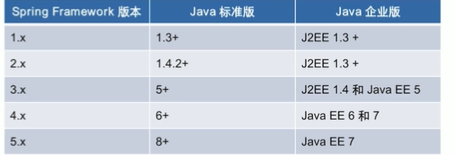
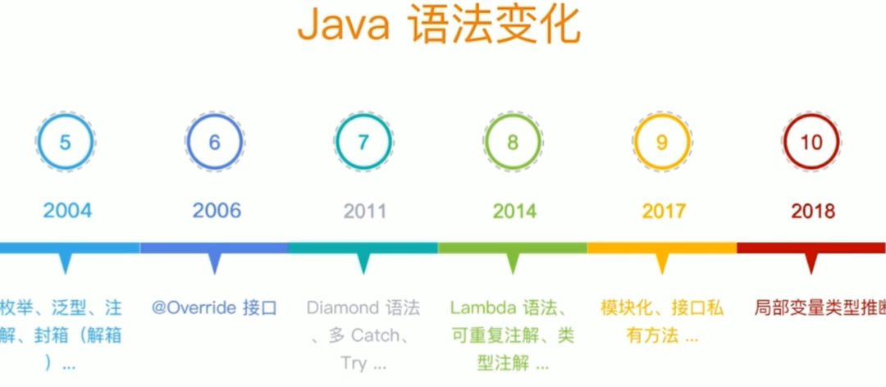

# Spring 扩展
# 浅认识
## Spring的核心特性

### 特性总览

 IoC容器

 Spring事件

 资源管理

 国际化

 校验

 数据绑定

 类型转换

 Spring表达式

 面向切面编程

## Spring的数据存储

 JDBC

 事务抽象

 Dao支持

 O/R映射

 XML编列

## Web技术

  Web Servlet技术栈

    Spring MVC

    WebSocket

    SockJS

   Web Reactive技术栈

     Spring WebFlux

     WebClient

     WebSocket

## 框架整合与测试

  远程调用(Remoting)

  java消息服务(JMS)

  java连接架构(JCA)

  java管理扩展(JMX)

  java邮件客户端(Email)

  本地调度(Scheduling)

  本地任务(Tasks)

  缓存抽象(Caching)

  SPring测试(Testing)
       
          模拟对象

          TestContext框架

          Spring MVC测试

          Web测试客户端
## java版本依赖与支持

## Spring 模块化设计

Aop (代理)

Aspects

Spring-Beans(SpringIoC的核心实现，依赖于Spring-Core)

Spring-context(SpringIoC的核心实现，依赖于Spring-Core)

Spring-core(Spring的核心模块)

Spring-instrument

Spring-jcl(日志框架)

Spring-Jdbc(对java的jdbc的整合)

Spring-messaging(Spring对消息服务的实现)

spring-orm (对mybits的整合)

spring-oxm (xml的序列化和反序列化)

spring-test (测试的整合)

spring-tx(Sping的事务抽象)

spring-web 

spring-webSocket(管理Session)

spring-webmvc

spring-webflux

## Spring在不同的版本对java的支持

## Spring的核心价值

### 生态系统

           Spring Boot Spring Cloud Spring Security Spring Data

### Api抽象设计

         Aop抽象  事务抽象  Environment抽象  生命周期

### 编程模型

             面向对象编程  
                 契约接口

             面向切面编程
                  动态代理
                  字节码提升
              面向元编程
                   配置元信息
                   注解
                   配置元信息
              面向模块编程
                   Maven Artifacts

                   Java9 Automatic Module

                   sPRING @Enable注解
              面向函数编程

                  Lambda

                  Reactive

###  设计思想
   面向对象

   测试驱动

   事件驱动

   函数驱动
## Spring基础面试题

### 什么是Spring Framework?

     是一个开源的java开发框架 ,针对企业级的java,提供web扩展点适用于java EE 场景，是一个pojo的编程模型。通过依赖注入和Aop编程模型。在复杂的编程环境中提供了松耦合。是一种易用性，企业环境的java语言上，

### Spring Framework有哪些核心模块?

         Spring-core(基础API模块，资源管理，泛型管理)  spring-context(事件驱动，模块驱动，注解驱动)  spring-aop(面向切面编程)
         spring-dao   spring-mvc      spring-beans(依赖查找，依赖注入)

### Spring Framework的优势和不足

    贯穿整个Spring里边，后续会进行更新

# Spring Ioc 重新认识

## IoC的主要实现策略

  使用服务定位模式，通常通过JSDI这种技术获取java EE的组件

  依赖注入，构造器注入，参数注入，set注入，接口注入

  上下文实现

  模板方法的设计模式
  
  策略模式

  Spring的主要实现策略分为两种：
     依赖查找

     依赖注入

### IoC容器的职责

  通用职责

     依赖处理
        依赖查找

        依赖注入
    声明周期管理
        容器
        托管的资源(java Bean 或者 其他的资源)

    配置
       容器

       外部化配置

       托管的资源(java Bean 或者其他的资源)

### IoC的实现

 java SE
   java Beans

   java ServiceLoader SPI

   JNDI

Java EE

  EJB
  Servlet

### 轻量级IoC容器是如何界定的

   能够管理应用代码，可以控制代码的运行和暂定

   轻量级容器可以快速启动

   容器不需要特殊的配置

   最小化API的依赖

 ###  轻量级容器的好处:

  实现最大化的代码复用

  更大程度的面向对象

  更大化的产品化，关注产品的效率

### 依赖查找 vs 依赖注入

依赖注入比依赖查找更遍历

依赖查找

   主动获取依赖的处理

    实现的便利性相对繁琐

    代码侵入业务逻辑

    依赖容器Api

    可读性良好

依赖注入：
 
      被动提供依赖处理

      实现便利性，相对遍历

      低的代码侵入性

      不依赖容器API

      可读性一般

### 构造器注入 vs Setter注入

   Spring团队，鼓励使用构造器注入

