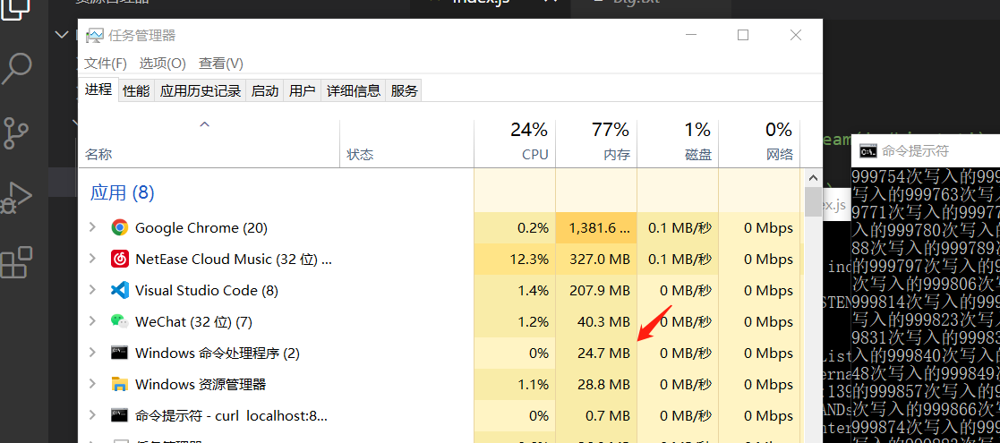

# 流
 ## 什么是流
     流（stream）在 Node.js 中是处理流数据的抽象接口（abstract interface）。 stream 模块提供了基础的 API 。使用这些 API 可以很容易地来构建实现流接口的对象。
## 为什么要使用流?
   举个例子，有A,B两个水桶,A水桶里装满水(我们把A水桶里的水视为需要返回给客户端的内容),B水桶是一个空桶(客户端)，我们要把A水桶里的水全部倒进B水桶里，这时候就需要 小明(服务器)来 把A水桶抬起来全部倒进B水桶里，小明需要耗费很大的 力气(内存)才能倒进去，但是我们给小明一个 容器(使用流) 一点一点的把A水桶里的水倒进B水桶里，小明耗费的力气(内存)此时就小了很多

  实例介绍

```JavaScript
//index.js
  //首先我们使用流来创建一个大文件
  const fs=require('fs');
  const file=fs.createWriteStream('./big.txt');
  for(let i=0;i<999999;i++){
    file.write(`写入的第${i}次`)
  }
  file.end();
  //http.js
  //现在我们的big.txt起码要有及时MB了
  //搭建一个服务器来返回我们的大文件

    //不使用流
  const fs=require('fs');
  const http=require('http');
  const server=http.createServer();
  server.on('request',(req,res)=>{
    fs.readFile('./big.txt',(err,data)=>{
      if(err){console.log(err);return;}
      res.end(data);
    })
  })
  server.listen(9000);


  //使用流
  const fs=require('fs');
  const http=require('http');
  const server=http.createServer();
  server.on('request',(req,res)=>{
    const data=fs.createReadStream('./big.txt');
    data.pipe(res);
  })
  server.listen(8000);
```

  接下来我们运行http.js看看使用流和不使用流访问服务器的情况

使用流

不使用流


可以看见使用流和不使用流的内存情况相差了很多，显然使用流的内存占用更少，所以这就是使用流的好处


## node里流的分类

 1. Readable  可读流。

 2. Writable -可写流。

 3. Duplex 可读可写流.

 4. Transform  操作被写入数据，然后读出结果。

## node模块里的流
  很多的node内置模块都有流的操作，比如http里的req是可读流，res是可写流,fs的createReadStream是可读流,createWriteStream是可写流

## readable可读流的方法
  可读流可以使用on来监听data,error,open,close,end事件
```JavaScript
   const fs=require('fs');
const server=require('http').createServer();
server.on('request',(req,res)=>{
    const src=fs.createReadStream('./big.txt',{
         //配置信息
    //如果没调置，则读取的数据会是 Buffer
    //也可以通过 rs.setEncoding() 进行设置
    encoding: 'utf8',
    //文件描述符，默认为null
    fd: null,
    //文件权限
    mode: 0o666,
    //文件读取的开始位置
    start: 0,
    //文件读取的结束位置(包括结束位置)
    end: Infinity,
    //读取缓冲区的大小，默认64K
        highWaterMark:1 
    });
    // src.on('readable',e=>{
    //     //监听readble事件也会暂停流动,要手动开启src.read(),才会继续
    //     let data=src.read();
    // })
    // src.on('open',e=>{
    //     console.log('文件打开时触发open事件')
    // })
    src.on('data',(e)=>{
        src.pause() //暂停了流动，所有的数据都会存储在内存缓冲区
      //当有数据进入流时会触发data事件
        console.log('触发了data事件')
        console.log('暂停了流的流动1秒后继续')
        setTimeout(()=>{
            src.resume()//继续流动
             src.unpipe(); //移除管道
        },3000)
    })
    // src.on('error',(e)=>{
    //     console.log('触发了error事件')
    // })
    // src.on('end',(e)=>{
    //     console.log('数据传输结束触发end事件')
    // })
    // src.on('close',e=>{
    //     console.log('文件关闭时触发的事件')
    // })
    //pipe就是一个管道，数据一点点的通过res返回给客户端
    src.pipe(res);//设置管道
})
server.listen(8000)
```

## writable(可写流的方法)
  ```JavaScript
  const fs=require('fs');
const ReadStream=fs.createReadStream('./big.txt');
const WriteStream=fs.createWriteStream('./index.txt',

    {
        //配置
     //设置缓冲区的大小
        highWaterMark: 1
    }
);

// function writeData() {
//     let cnt = 9;
//     return function () {
//         let flag = true;
//         while (cnt && flag) {
//             flag = WriteStream.write(`${cnt}`);
//             console.log('缓冲区中写入的字节数', WriteStream.writableLength);
//             cnt--;
//         }
//     };
// }
 
// let wd = writeData();
// wd();
//当缓冲区中的数据满的时候，应停止写入数据，
//一旦缓冲区中的数据写入文件了，并清空了，则会触发 'drain' 事件，告诉生产者可以继续写数据了。
// WriteStream.on('drain',() =>{
//     console.log('可以继续写数据了');
//     console.log('缓冲区中写入的字节数', WriteStream.writableLength);
//     wd();
// });
// //文件被关闭时触发
// WriteStream.on('close',  () =>{
//     console.log('文件被关闭');
// });
// WriteStream.end('传输文件终止')
// WriteStream.on('finish',()=>{
//     console.log('传输文件完成了')
// })
// //当写入数据出错时触发
// WriteStream.on('error',  () =>{
//     console.log('写入数据错误');
// });

//调用cork函数不会因为超出缓冲区而强制将内容输出到文件里
// WriteStream.cork();
// console.log(WriteStream.write('1','utf8'));
// console.log(WriteStream.write('2','utf8'));
// console.log(WriteStream.write('3','utf8'));
// WriteStream.uncork();
//调用uncork会将缓冲区的内容输出到文件里


  ```
   