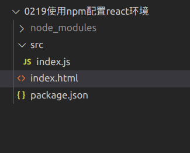
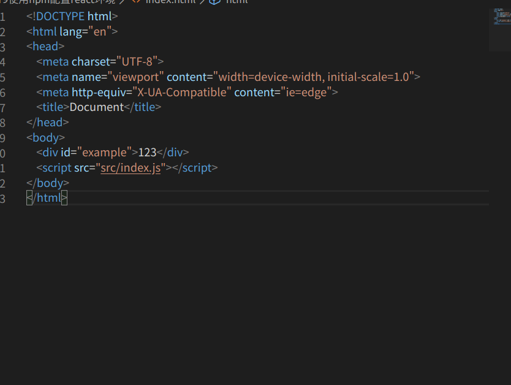
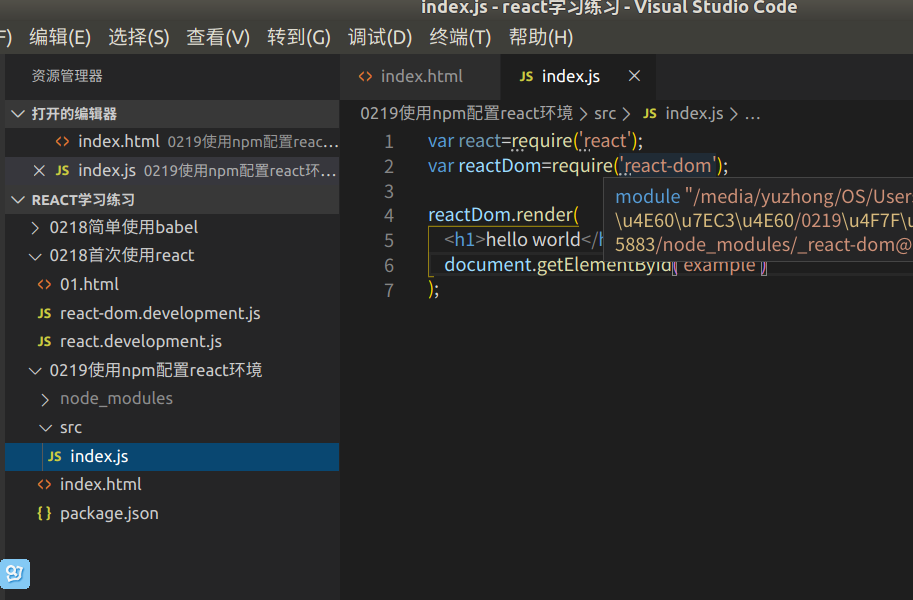
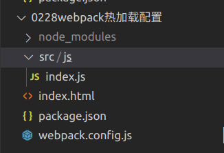
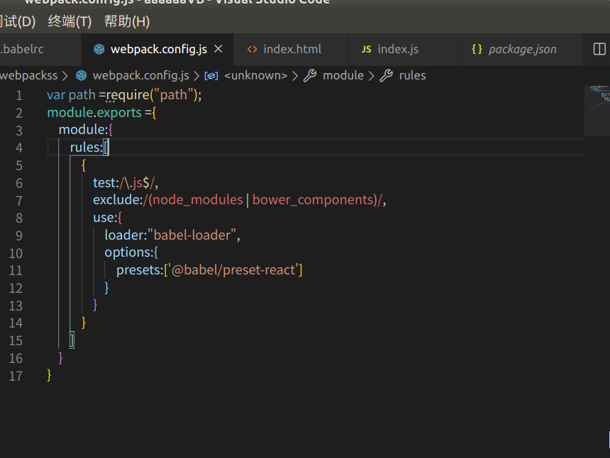

## 我们在去使用npm安装好所依赖的包之后要去创建我们的项目目录，如图所示：

  

#### 我们的项目目录是这样的因为我们的react同样是spa单页面应用所以我们需要最后所有的东西都在index.html里边，而src是我们的一个文件夹项目的源码放在这个文件夹里边,src里的index.js是我们的配置文件，接下来就要通过webpack去进行配置

##### 因为我们直接去使用 npm 安装好 react 所依赖的包之后我们的浏览器是不会去识别的，所以需要通过webpack去进行配置,如图所示:
  

## 通过webpack热加载配置我们首先需要一个webpack.config.js文件来配置我们的webpack加载，如图所示：

# 下面是webpack4简单搭建react环境

## 首先我们需要去安装所依赖的包，分别是:“webpack” “webpack-cli” ”webpack-dev-server“,然后安装"react","react-dom",再安装“babel-loader@next”,“@babel/core”,"@babel/preset-react"
## 依赖包安装完成之后首先我们要在项目的根目录下创建dist文件夹和src文件夹src文件夹用来存放源码，dist文件夹用来存放我们打包后的文件，然后创建webpack.config.js文件用来配置我们的webpack，配置如下：

## 配置完成后我们要在项目根目录下创建一个index.html,然后在src文件夹下创建index.js文件（index.js文件是webpack默认的入口文件）然后我们就可以在index.js里写react代码例如：

## 然后我们可以在终端输入webpack进行打包以及代码的转换，打包完成之后我们会在dist文件夹下看到打包完成的main.js文件，然后我们需要手动的把man.js文件手动的引入index.html里边。接下来我们可以直接打开index.html文件进行查看或者输入命令
"webpack-dev-server --mode development --oput-public-path dist
"
然后在浏览器打开localhost:8080查看