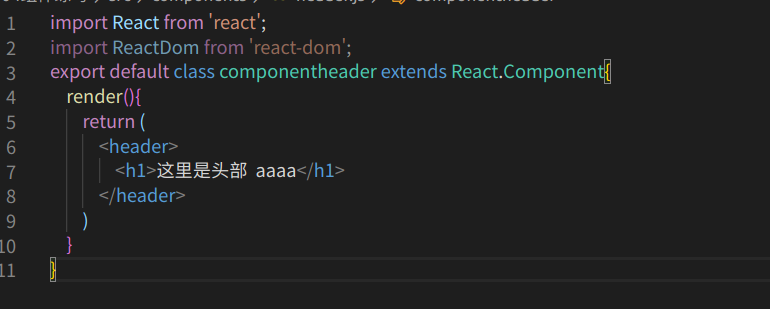
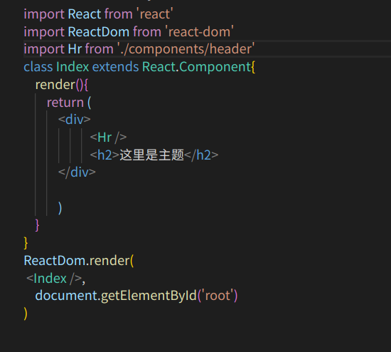

# react组件的概念
    react组件基本上和Vue一样但是写法有所不同正所谓Vue是自动挡，react是手动挡。
# react组件如何写
    建议在去写组件的时候单独创建一个文件夹components文件夹。
    react的组件还是js文件，不过要这样写，首先我们要引入react和react-dom，然后利用react的component来写
    例如这样：
   
    class  名字 extends 要继承的方法  是es6的一种新特性也就是继承，这个是有关于构造函数的。
       但是要知道return ( ) 里边只能有一个DOM节点,这个就和Vue很像Vue的组件里边也是只能有一个DOM节点，且如果我们想要使用这个组件那么必须要有export default进行导出，然后想在哪里用这个组件就要进行引入这个该组件的js文件。

# 最后的src下的index.js文件应该这样写：
   
