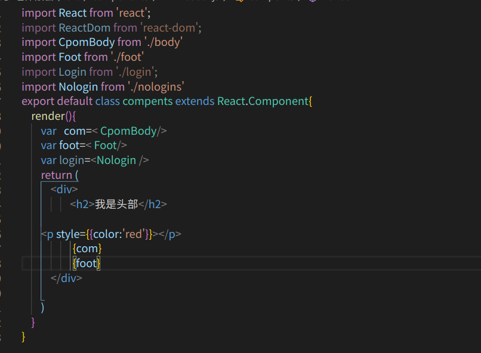
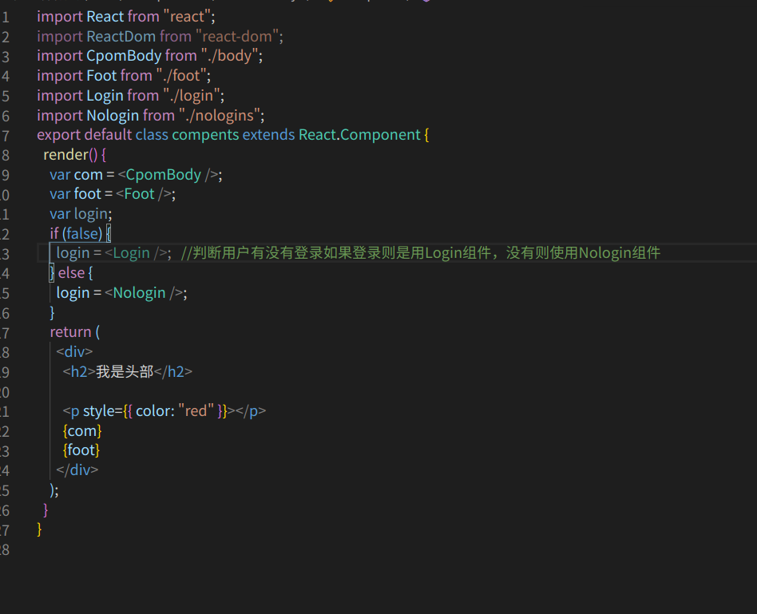
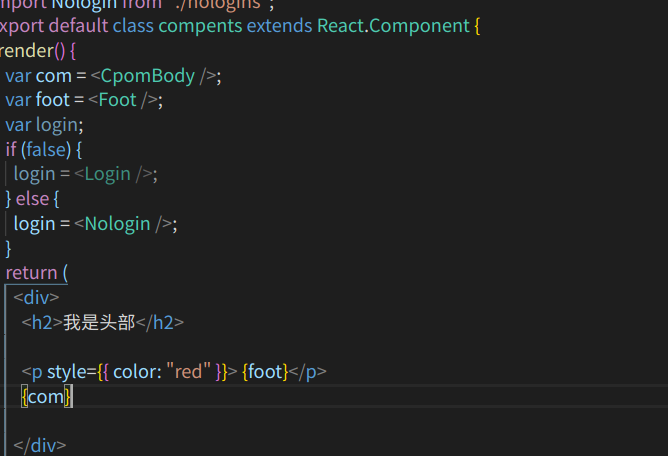

# react组件的概念
    react组件基本上和Vue一样但是写法有所不同正所谓Vue是自动挡，react是手动挡。
# react组件如何写
    建议在去写组件的时候单独创建一个文件夹components文件夹。
    react的组件还是js文件，不过要这样写，首先我们要引入react和react-dom，然后利用react的component来写
    例如这样：
   
    class  名字 extends 要继承的方法  是es6的一种新特性也就是继承，这个是有关于构造函数的。
       但是要知道return ( ) 里边只能有一个DOM节点,这个就和Vue很像Vue的组件里边也是只能有一个DOM节点，且如果我们想要使用这个组件那么必须要有export default进行导出，然后想在哪里用这个组件就要进行引入这个该组件的js文件。

# 最后的src下的index.js文件应该这样写：
   

  # 多组件嵌套
      我们有多个组件如果我们需要组件嵌套那么我们就可以在需要嵌套组件的组件标签中引入该组组件，然后在需要嵌套的组件的render函数的return 的括号里的dom节点里写该组件标签即可。不过我们还有下面引用组件的方法，就是我们可以在render里去声明变量然后把组件标签赋值给变量我们在DOM节点里使用插值语法即 {变量名即可}，例如：
   

   ## 这样在render函数里通过声明变量去使用组件的好处就是可以对组件去进行判断或者进行其他操作。例如
   

   # 注意：
      我们在react里使用插值语法时是与   Vue里的插值语法有所不同的Vue在   
在这里插值要使用{{}}
，在react里边如果是在标签里边     
 
   要使用{{}}去进行插值，
  在这里 
  要使用{}   去进行插值   例如：

