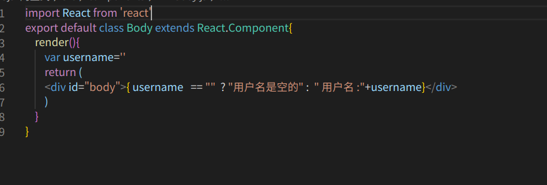
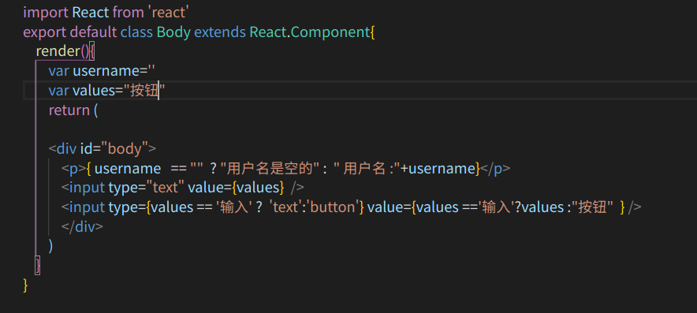

#  三元表达式子的使用
   在标签里可以使用三元表达式来进行对数据的一些判断或者显示,不过要是在标签里比如，< p > 在这里使用三元表达式   </ p>  一定要用  {}   包裹三元表达式

   例子：
   

  #  在标签内部插值或者使用三元表达式
     要在标签内部 <input    value=在这里使用插值或者三元表达式>   的时候也要使用{}  包裹，但是正常的value或者其他的标签的属性的属性是都是这样写的   id=""  但是如果要使用插值或者三元表达式不要有引号

     例子：
   