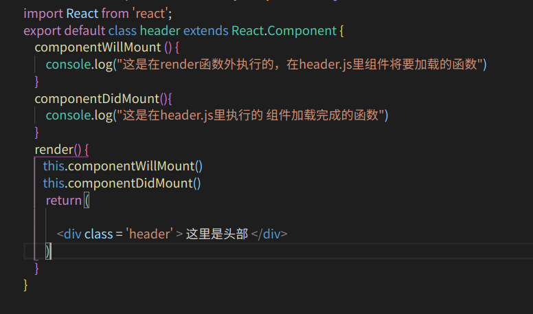
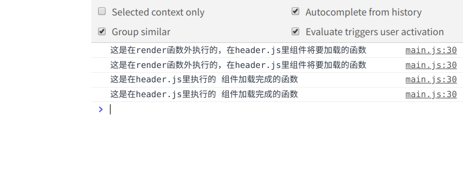
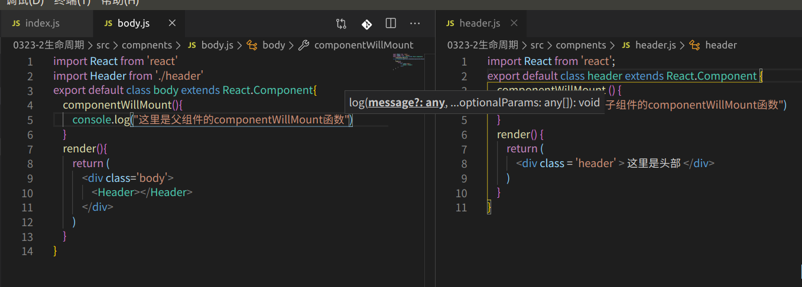

# 生命周期
  Vue的生命周期哦不过是，创建，挂载，更新，销毁
   react的组件的生命周期也只不过是组件的：创建，挂载，更新，销毁
## compoentWillMount
    在组件创建的时候执行的函数

 ## componentDidMount
    在组建销毁的时候使用的函数   

   ## 生命周期函数的使用
   react的生命周期函数都是要使用在render函数外的，在render函数里边只能进行调用，  this.生命周期函数（）                                        
   但是，在render函数里写的生命周期函数就已经是调用了，如果在render里边再次进行调用则该函数会调用两次
   例子：

   
   

   ## 在嵌套的组件中使用的生命周期函数
       如果在嵌套的组件里边使用生命周期函数，比如父组件里边有一个componentWillMount函数而且子组件里边也有一个componentWillMount函数，那么会先去执行父亲组件里的componentWillMount函数，再去执行子组件里的componentWillMount函数
       例子：

   
   

   ## 关于官网更多的生命周期函数
       官网地址：https://facebook.github.io/react/docs/component-specs.html#lifecycle-methods
  