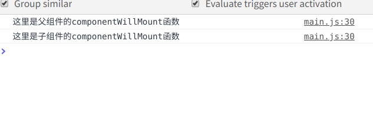

# 生命周期
  Vue的生命周期不过是，创建，挂载，更新，销毁
   react的组件的生命周期也只不过是组件的：创建，挂载，更新，销毁

   ## 生命周期函数的使用
   react的生命周期函数都是要使用在render函数外的，在render函数里边只能进行调用，  this.生命周期函数（）                                        
   但是，在render函数里写的生命周期函数就已经是调用了，如果在render里边再次进行调用则该函数会调用两次
   例子：

   
   

   ## 在嵌套的组件中使用的生命周期函数
       如果在嵌套的组件里边使用生命周期函数，比如父组件里边有一个componentWillMount函数而且子组件里边也有一个componentWillMount函数，那么会先去执行父亲组件里的componentWillMount函数，再去执行子组件里的componentWillMount函数
       例子：

   
   

   ## 关于官网更多的生命周期函数
       官网地址：https://facebook.github.io/react/docs/component-specs.html#lifecycle-methods
  

  # 四大阶段
     React的生命周期分为四个大的阶段，分别是:
   ##  intialization 初始化阶段
       我们在去写组件的时候，在定义state的时候会在  constructor,函数里去进行初始化定义，这个constructor函数不输入react他是ES6的构造函数里的
   ## Mounting 挂载阶段(虚拟Dom挂载的时候)
      挂载阶段又分为三个阶段
        componentWillMount()   组件即将被挂载的时候
        render() 组件开始挂载渲染
         componentDidMount()组件挂载完成后
   ## 更新阶段
        更新阶段又分为两大部分
   ###  props  属性
      conponentWillReceiveProps()  这个函数在顶级组件里是不会执行的，也就是该函数只在有父组件的组件中才会被执行。
      且该函数在我们的子组件第一次被渲染的时候不会执行，只有当我们的父组件传递给我们的子组件的数据发生变化的时候在会被执行。
      该函数执行完成之后会进行执行下边状态的函数
   ### states  状态
      shouldComponentUpdate()  组件更新之前，这个函数是我们的组件更新之前，但是刚开始是不会执行的只有当我们组件的状态被改变的时候才会进行执行，因为我们的组件的状态改变后render函数肯定是要重新执行的。且函数的最后还要返回true或者false，不管返回true还是false该函数都会执行但是返回false我们的render函数就不会再去进行渲染，返回true则render函数继续进行渲染。
      componentWillUpdate(),在组件更新之前，但是在shouldComponentUpdate函数执行之后执行的，这个函数的执行还是要取决于shouldComponetUpdate的返回值，如果返回true则该函数会执行，如果false则该函数不会执行
      componentDidUpdate()  在组件更新之后执行

   ## 销毁阶段
      componentWillUnMount()  组件被销毁的时候之前