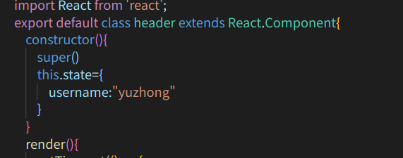
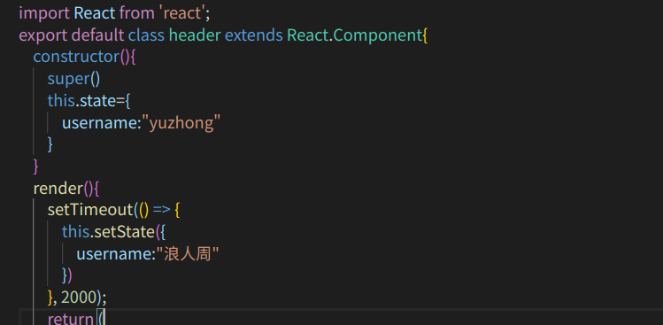

# state属性
  这个state属性的作用就相当于Vue中的data用来存储动态数据的不过使用方法有点不同。
  例子：

  这个设置state属性要写在render外边

## constructor函数
   该函数是关于构造函数的继承的，首先返回构造对象的所有函数，
 ## super（）
   这个super是用来对所有的基类方法进行初始化

 # 修改 state属性
     修改可以要使用this.setstate()方法进行修改

     例子：
