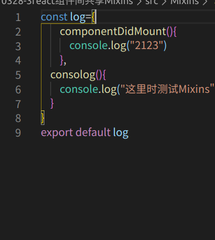
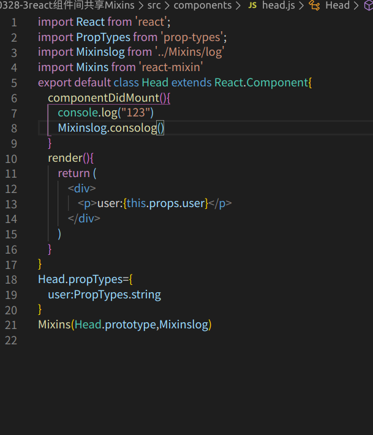

# Mixin

  使用Mixin 要通过cnpm去进行下载这个包   "cnpm install --save react-Mixin@2"

  Mixin 是用来独立组件间共享的函数这个组件间共享也就是一个通用和存储的方法，我们可以将一个组件里边所有的函数都单独写在一个js文件夹里边，然后在使用这些函数的组件里调用。这个单独的js文件也是可以写组件的生命周期函数的

  例子：
  

  我们要在组件里边调用这些函数

  

