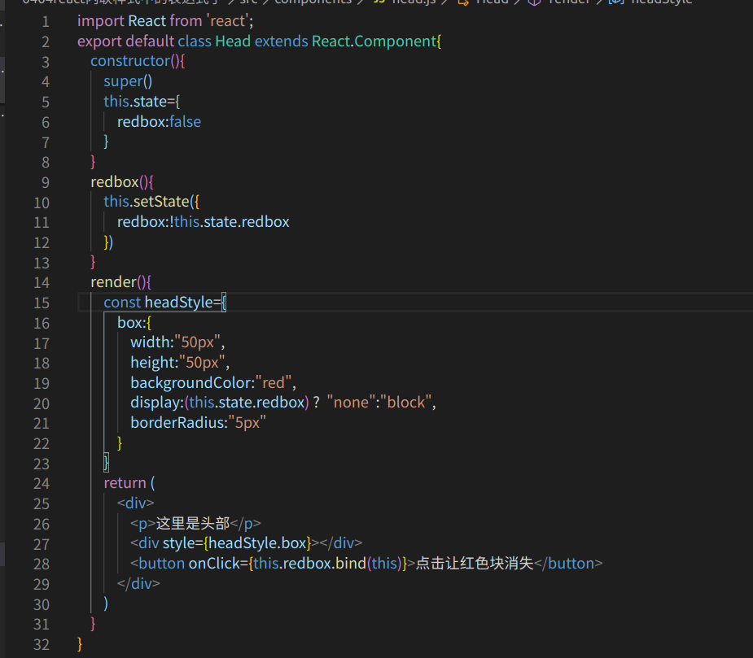

# 用js的形式写css样式
   用js的形式写css我们需要使用定义对象的方法，我们需要先声明一变量，变量的值为对象，对象里的属性和属性值即为是css样式，但是我们如果写原声的css样式则需要将属性和属性值都需要加上引号，如果属性不加引号那么例如：background-color   就要这样写backgroundColor 
    
    写完样式之后我们只需要在标签里边协商style属性={样式} 即可

   例子：
   

     这样写的css样式只能使用在原生的HTML结构上，不能使用在组件标签上

# 正常在css文件里写样式
    我们可以在写正常的css文件然后在里边写样式，样式写完之后我们只需要在index.html里引入该css文件即可，但是我们在react里我们的HTML标签的class要写成clssName不能写class

# 内联样式表达式
    我们在写内联样式是可以使用表达式子去写的，就是内联样式里的数据可以是我们人为去进行控制的且可以在样式中写入三元表达式,不过以往我们使用插值是使用{}  ,但是在内联样式表达式里使用插值要使用（）

    例子：

   