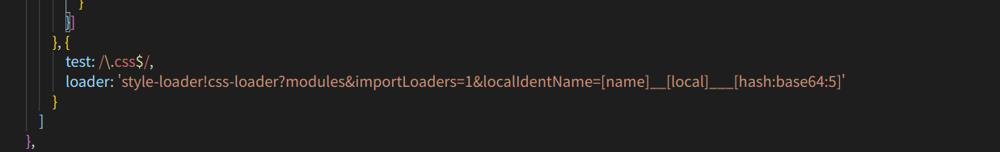
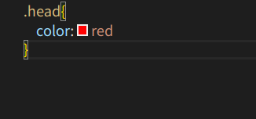
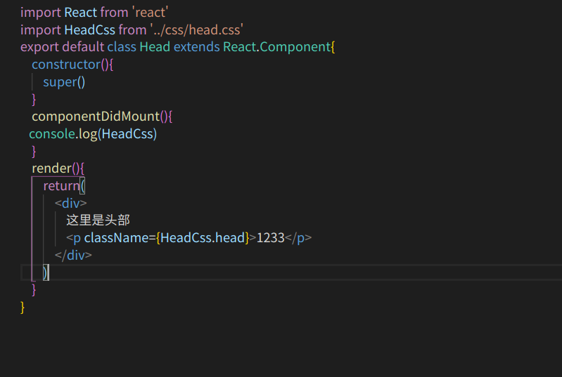

# css模块化
   因为我们前边几种写css的方法使用内联样式会使我们的组件文件代码变得冗余，且容易发生变量污染所有我们有了将css模块化来写。

    首先我们需要安装css-loader和style-loader两个包，注意版本要是低版本的高版本的暂时不知道如何配置，style-loader的版本是0.13.1 ,css-loader的版本是0.25.0

# 在wbpack.config.js文件里配置安装完成依赖包之后我们要在我们的webpack.config.js文件里边去进行如下配置

     {
         test: / \.css$/,
          loader: 'style-loader!css-loader?modules&importLoaders=1&localIdentName=[name]__[local___[hash:base64:5]'
     }

    例子：
   

   # 在组件里去引入使用

      css文件

      组件

   

## 为什么要在使用css的时候这样写  className={Headcss.head}

       因为我们可以看上边的css文件，里的选择器是class选择器，所以我们也知道className是react中用来写标签的class的，{HeadCss.head}  这个是因为我们在对css文件进行编译的时候对css里的.head进行了转码用来防止变量污染