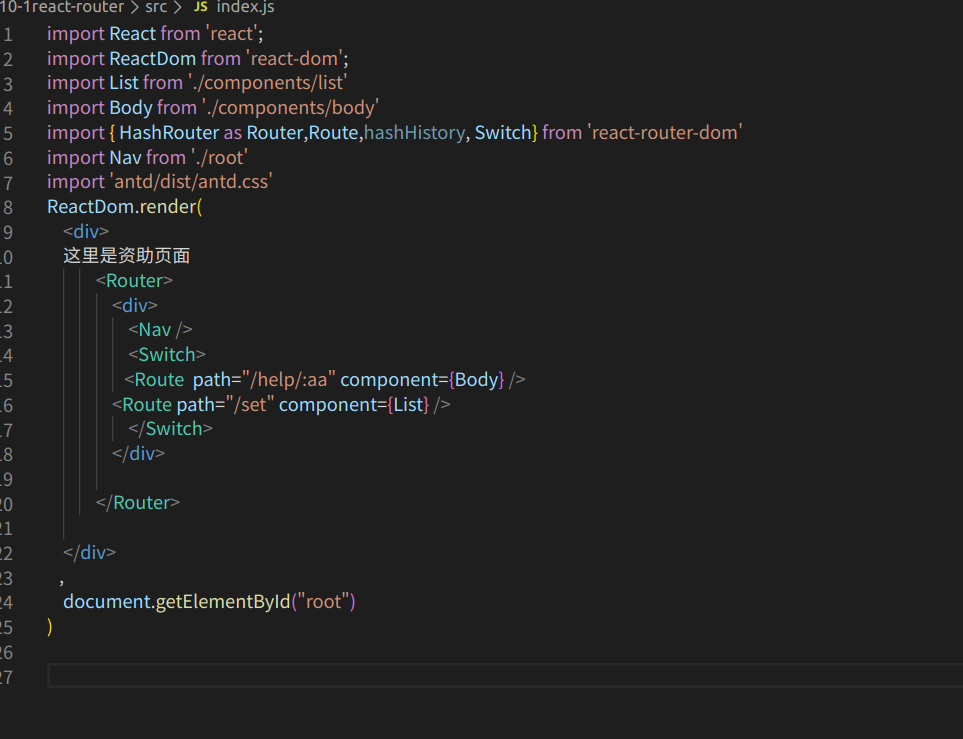
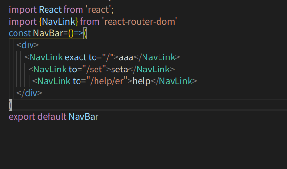
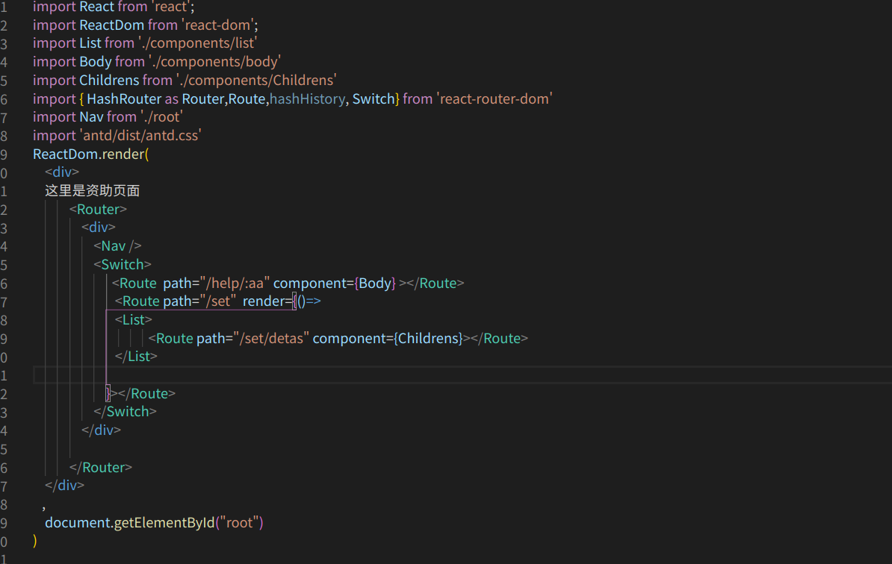
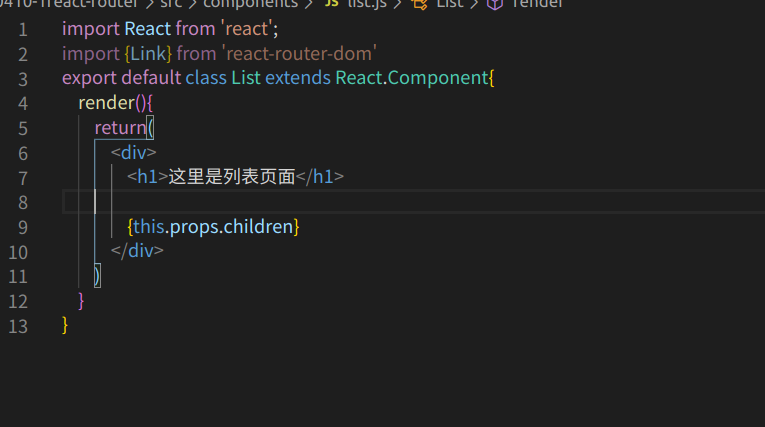
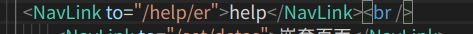
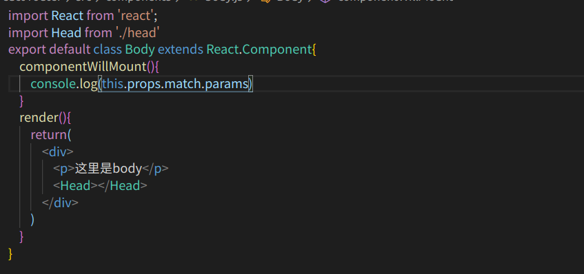

# 路由
   使用react的路由我们要通过命令去安装依赖包，
    命令: cnpm install --save-dev react-router-dom

# 使用路由
    依赖包安装完成之后我们需要在页面中去进行进行引入才能去进行使用，我们在哪个组件中使用就在哪个组件中引入依赖包然后这样去进行使用

   

      HashRouter 是我们所需要使用了路由因为react里的路由有两种模式，一种是BoweRouter我们正常的   / 下的模式一种是HashRouter模式也就是 #/ 的模式  Nav是我们的导航组件，Switch是我们的当前组件的信息，Router标签的是定义我们当前使用的路由模式，Route标签是我们定义的路由，path就是路由的路径，component就是我们要在路径下显示的组件

   ##  写完我们的路由之我们要去定义一下我们的导航
        导航可以单独写一个文件或者跟路由写在一块也行,导航同样需要使用我们安装的路由的依赖包，里边有一个NavLink组件，就是相当于我们的a标签，to就是要跳转路由的地址

# 嵌套路由
  有时候我们会需要去进行路由的嵌套，路由嵌套是这样的我们需要在有嵌套的路由中写render箭头函数然后用父路由的组件标签包裹住子路由的路由

  然后我们需要在父路由的组件里写上{this.props.children}用来显示子路由组件

# 路由传值
    路由间传值我们只需要在path下写上/:自定义名称,然后我们就可以通过link里边的to属性去传值了
     定义传值：
   

      进行传值
   

    接收传递的数据
          this.propsmatch..params就是我们路由间传递过来的数据
   