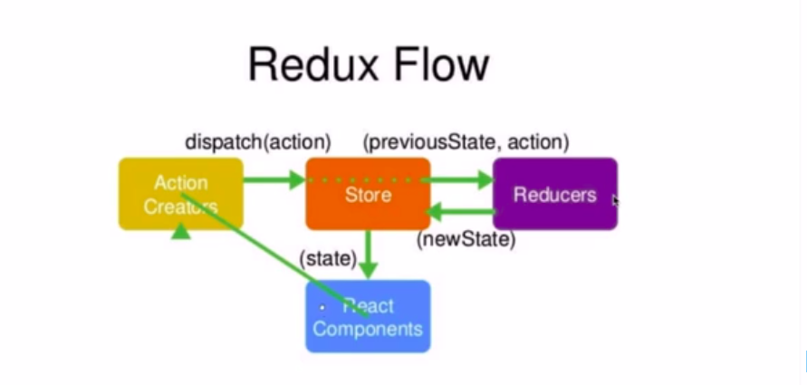
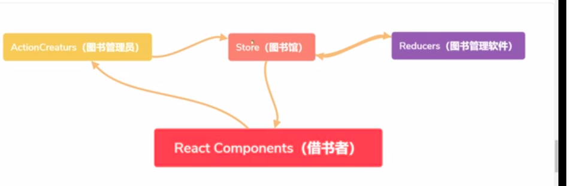

# Redux

## 初始 Redux

      在学完react基础之后我们可以做一些简单的项目，因为大项目之间的组件嵌套的层级比较深，组件通信比较麻烦，所以我们需要了我们的Redux。

## Redux 简介

       Redux里有一个store数据仓库，我们需要的时候可以去数据仓库去获取，修改的时候也可以随着去修改

## Redux 工作流程

   
   这张是官方的图文解释，就是比如我们的组件想要一个数据，要先去找到Action Creaturs 然后ActionCreaturs去找到store，store如果有会直接传递给组件，如果store没有，store会去找到Reducers，Reducers会把结果f返回给store，store会传递给组件


这张图是技术胖的解释，是拿借书举的例子

## 初次建立 store 仓库

我们首先需要通过 cnpm 或者 npm 或者 yarn 去安装我们的 redux，
安装完成之后我们就可以开始创建我们的 store 仓库了，我们可以在 src 目录下创建一个 store 文件夹，然后在 store 文件夹下创建 index.js 在 index.js 里创建我们的 store 仓库

```javaScript
        import {createStore} from 'redux'  //引入redux
        const store=createStore() //创建store仓库
        export default store //将store仓库暴露出去
```

像上面的代码我们就将我们的仓库创建好了，但是此时我们的仓库还没有管理员，我们需要去创建一个管理员模块 reducer，在我们的 store 文件夹创建一个 reducer.js
```javaScript
      //reducer.js
            const defaultState={} //初始化的数据，因为暂时没有所以写成一个空的，在做项目的时候我们肯定要往这里写东西的，这里的初始化数据指的就是我们的项目第一次需要使用的数据
            export default(state=defaultState,action)=>{
             return state 
            }//这里就是暴露出去一个方法函数


//store/index.js
import {createStore} from 'redux'  //引入redux
import reducer from './reducer'//引入我们的管理员模块
        const store=createStore(reducer) //创建store仓库，且将我们的管理员传递进去
        export default store //将store仓库暴露出去
```
接下来我们就可以使用我们的store仓库里的数据了，只需要引入store/.index.js，然后调用store.getStete()方法即可。
例子：
   ```javaScript
   //要使用store仓库里的数据的组件
   import  React from 'react'
   import store from '../store/index'//这里引入的就是我们创建的仓库
   class xxx extends React.Component{
         constructor(){
               super()
               this.store=store.getState()//getState方法只不过是获取到了store仓库的数据，如果在组件里使用可以进行赋值
         }
         render(){
               return(
                     <div>
                          
                     </div>
               )
         }
   }
   ```
   ## 调试工具 Redux Devtools
      在谷歌应用商店下载Redux Dev Tools 然后对我们的redux进行调试，不过使用该调试工具要在store里加上以下代码

 ```javaScript
             //store.js
             import {createStore} from 'redux'  redux
             import reducer from './reducer'//管理员模块
             const store=createStore(reducer,
                 window.__REDUX_DEVTOOLS_EXTENSION__ && window.__REDUX_DEVTOOLS_EXTENSION__ 
                 ()
                 //这行代码是是我们的调试Redux的工具的官方文档要求我们去进行添加的
                 )
             ) 
             export default store 
```

##  对store仓库的增删改查
  在上面初次建立store我们已经学会了如何建立store仓库和使用store仓库中的数据，接下来我们来进行对store的仓库里的state进行操作
```javaScript
         
         //xx组件
      import React from 'react'
      import store from './store/index'
   
      class xx组件 extends React.Component{
               constructor(){
            super()
            this.state={
                  typevalue:store.getState().typevalue//可能有小伙伴会有疑问为什么我们的store仓库里的数据要赋值给组件的state再去进行使用，这是为了我们store仓库里的数据有变化的时候我们的组件我们使用该数据的组件也能随着更新
            }
           store.subscribe(this.changeState.bind(this))  //store的订阅，可以粗略理解为监听store的变化如果有变化则执行传递进去的函数
      }
      changeState(){
            this.getState({
                  
            })
      }
            render(){
                  return(
                        <div>
                              {this.state.typevalue}
                        //在这里我们已经使用到了store仓库里的数据
                        <button onClick={this.changeStoreTypeValue.bind(this)}>点击修改store仓库里的typealue的值</button>
                        </div>
                  )
            }
            changeStoreTypeValue(){
                  const action={
                    type:"",
                    value:""//这个action里边的键值对随便写，不过通俗是写一个type，一个value比较好。
                  }
                  store.dispath(action) //派发action，action里边包含我们要传递的数据
            }
      }
      
      //reducer.js

         //我们再reducer里边来接受我们再组件里派发的reducer
        const defaultState={
              //初始化的仓库数据
        }
        export default (state=defaultState,action)=>{
              //再reducer里边只能接受state，不能改变state
              if(//先进行判断我们传递过来的action的type){
                    //我们在这个if判断里边对我们传递过来的action进行逻辑操作
                    const newState=JSON.parse(JSON.stringify(state))
                    //我们可以对初始化的State进行一个拷贝
                    //然后对newState进行修改
                    return newState
                    //修改完成后，我们将给store返回一个新的state，store接受到新的state发现与自己已有的state不一样会自动进行更改
              }
         return state //这里是将初始化的stat返回给store的
         //上边的if判断可以有多个以为了我们传递不同的action，然后不同的action都有属于自己的逻辑判断
        }
       
 ```

 # Redux中间件之Redux-thunk


 # Redux中间件之redux-saga