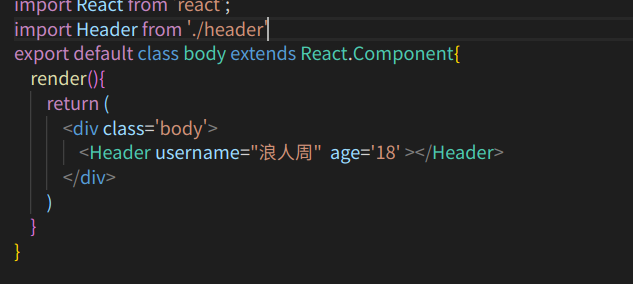
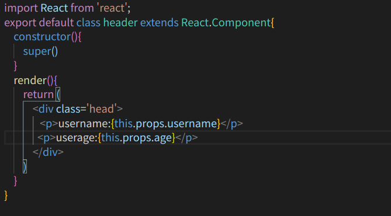
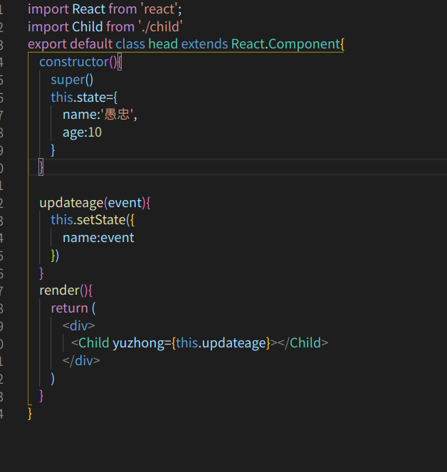
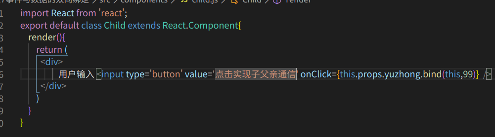

# 父子通信
react的父子通信使用props属性通信
## props 
props属性同样跟Vue中的一样是用来作父子组件间通信的，不过使用方法不太一样，首先在父组件中找到要传递数据的子组件的组件标签内设置自定义属性="要传递的数据"，然后在子组件中使用this.props.自定义属性名即可获取该数据
例子：
父组件

子组件：

# 子父通信

##  第一种方法实现子父通信
  这种方法实现的子父通信用到props属性首先要进行父子通信之后才能进行子父通信没有去进行直接的子父通信。

  首先现在父亲组件里去定义一个函数然后通过父子通信将该函数传递给子组件之后，在子组件里边去进行调用该通过父子通信传递过来的函数函数，然而再子组件去调用该函数的时候传递的参数就传递到了父组件里边

     父组件：

   

      子组件：
   

# 兄弟组件通信
兄弟间组件通信，一般的思路就是找一个相同的父组件，这时候既可以用props传递数据,如果适用的话可以选择进行使用Redux去进行通信