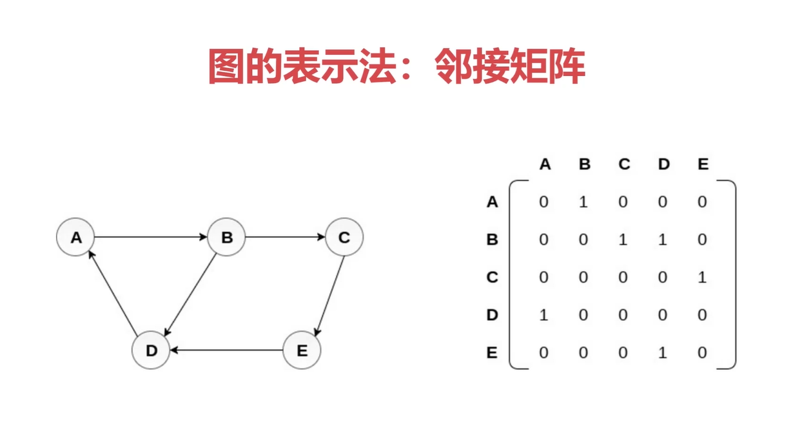
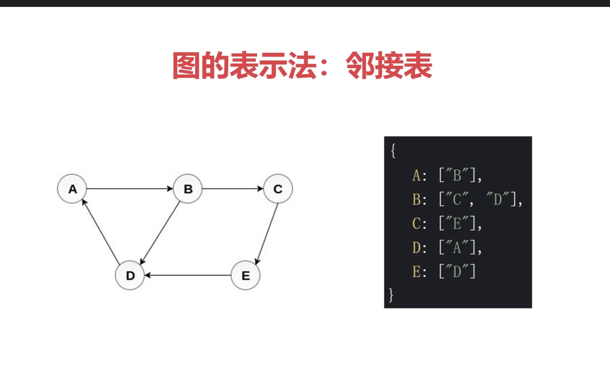

# 图
  图是网络结构的抽象模型，是一组由边来连接的抽象节点
    图可以表示任何二元关系，比如：道路，航班
      一条边只可以连接两个节点
  JavaScript没有图这个数据结构，但是可以用Objeact和Array 构建够图
   图的表示法:邻接矩阵，邻接表，关联矩阵
 
 
 ## 邻接矩阵
  
 先创建一个矩阵，比如A能连接到B那么我们则在x轴上将B的位置，Y轴上A的位置写成1，B能连接到C和D，那么我们则在X轴上C的位置和D 的位置，Y轴上B的位置 写为1

 ## 邻接表
  
   比如A能连接到B，那么A的数组里就包含A，B能连接到C，D那么B的数组里就包含C和D

 ## 图的常用操作

    深度优先遍历（尽可能深的访问搜索(访问)图的分支）  ，广度优先遍历(先访问离根节点最近的节点)

 ## 深度优先遍历
   1.访问根节点
   2.对根节点的没访问过的相邻节点进行深度优先遍历
   示例代码查看lianxi.js

## 广度优先遍历
  1.新建一个队列
  2.把对头出队并访问
  3.将对头没访问过的节点入队
  4.重复第二三步，知道队列为空