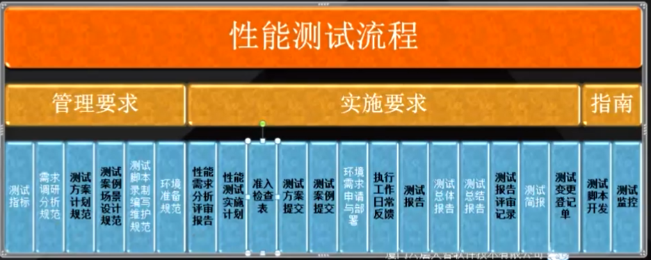

# 性能测试初步认识  
  系统的性能是一个很大的概念，覆盖面非常广泛，对一个软件系统而言包括执行效率，资源占用，稳定性，安全性，兼容性，可扩展性，可靠性等等。性能测试用来保证产品发布后系统的性能满足用户需求。性能测试在软件质量保证中起重要作用。
## 生产性能故障的原因
  通常由于体系结构或设计问题造成。

  性能问题在开发过程的早期已经引入，而大部分开发团队直到集成测试或更晚的时候才予以考虑

  测试人员不够专业
## 性能认知
  性能是衡量在一个环境下运行一个或者多个应用程序的效率。
  主要的指标一般是响应时间和吞吐量，Tps,资源使用率，交易成功率

  响应时间 vs 负载
    响应时间越大负载越高

 ### 资源利用率 
   对不同系统资源的使用程度
    例如:服务器的cpu 内存 网络带宽等。   
 ### 事务
   从客户端发起的一个或多个请求(这些请求组成一个完成的操作)，到客户端接收到服务端的响应，称为一个事务

 ### TPS
   每秒钟系统能够处理的事务数，在每一个场景中每秒的事务通过，失败和停止的数量。

 ### 请求响应时间

    客户端发起一个请求开始，到客户端接收到服务器返回的响应，整个过程所耗费的的时间

### 事务响应时间
     事务可能是由一个或多个请求组成的
     事务响应时间主要是针对于用户的角度而言，如转账。

 ### 并发定义
   没有严格意义上的并发。并发总有先后，无论是1毫秒还是1微妙，总有一个时间差，所以并发讲的是一个时间范围内，比如1秒内。

### 并发用户数

 同一单位时间内，对系统发起请求的用户数量

### 吞吐量
  吞吐量指的是单位时间内处理的客户端请求数量

   从技术角度看通常情况下，吞吐量用 请求数/秒 OR 页面数/秒 来衡量

   从业务角度看:吞吐量也可以用  访问人数/天 页面访问量/天 来衡量

### 吞吐率
单位时间内网络上传输的数据量
  吞吐率=吞吐量/时间

### 点击率
   每秒钟用户向服务器体骄傲的请求数。这个指标是web应用程序特有的一个指标，可以想象为每秒钟用户总共在页面上进行多少次点击动作，但是需要注意的是一次鼠标单击的操作后，客户端有可能向服务器发送了多少次请求。

## 性能测试技能树
    
     1、懂前端，懂后端(c/Java)
     2、操作系统 Linux 
     3、数据库 Mysql
     4、测试工具 (jmeter,Loadrunner)
     5、网络协议 
     6、业务相关知识
     7、客户端浏览器的选型与版本
     8、web代理服务
     9、应用中间件 Tomcat Nginx Weblogin Websphere
     10、 Jdk中间件 SUN JDK，HPHDK,IBM jdk
 
## 性能测试的目的
    发现(系统)性能瓶颈
## 性能测试的分类
 性能测试是一个非常广泛的概念，包括很多方面的测试，也可称之为非功能测试

### 自动化测试
   自动化测试属于功能测试的范围，由于其测试方法要求测试人员拥有一定的代码能力，所以被分为单独的测试模块。

### 负载测试
    负载测试是确定在各种工作负载下系统的性能，目标是测试当负载逐渐增加时，系统组成部分的响应输出项，例如:通过量，响应时间，cpu负载使用等如何决定系统的性能，例如稳定性和响应等。

     负载测试通常描述一种特性类型的压力测试，即增加用户数量以对应用程序就行压力测试

### 压力测试
    通过逐步加压的方法，使得系统的某些资源达到饱和甚至失效的状态，简单粗暴的解释什么条件下能把系统整崩溃
### 负载压力测试
  负载压力测试是性能测试的重要组成部分，负载压力测试包括:并发性能测试，疲劳强度测试，大数据量测试

### 并发测试
  在同一事件内，多个虚拟用户同时访问同一模块，同一功能，通常的测试方法是设置集合点

### 容量测试
  指数据库层面的，目标是获取数据库的最佳容量的能力，又称之为容量预估。具体测试方法为在一定的并发用户，不同的基础数据量下，观察数据库的处理能力，即获取数据库的各项性能指标。

### 可靠性测试
     稳定性测试/疲劳测试，长时间的运行系统是否稳定，如cpu使用率在80%以上，7*24小时运行，系统是否稳定。


### 异常测试
     失败测试，指系统架构方面的测试。如在负载均衡架构中，要测试宕机，节点挂掉等情况系统的反映。

## 性能测试的工作流程

     需求分析

     性能指标制定

     脚本开发

     场景设置

     监控部署

     测试执行

     性能分析

     性能调优

     测试报告


## 常见的系统应用分层架构

 显示层(view)  web Android Ios h5

 控制层(Controller) Api

 数据存储层(model) mysql mongodb redius

## 性能测试的需求分析

### 分析的目的
  明确测试指标

  明确测试场景

### 性能测试工具

   使用工具可以节省时间

   常用工具

      LoadRunner 重量级 不开源 C/java1.5 收费

      JMeter 轻量级 开源 JAVA 不收费

# 测试工具篇

## UNIX 操作系统监控分析

  操作系统: IBM-AIX HP-UX LINUX

  监控分析工具 nmon AIX LINUX hpunix glance

  资源瓶颈典型症状

## LoadRunner（三大控件）

### LR的主要步骤


    1、创建脚本（vu）:捕获在应用程序中执行的最终用户操作，vu生成脚本的方式就两种:一种是自写或者嵌入源码，一种是录制生成。


    2、设计场景(Controller) :设置负载测试场景，控制vu产生压力，并搜集测试结果。

    3、分析结果:分析负载测试期间LR生产的性能数据。
  
## 初识JMeter
     Jmeter的组成
        测试计划
              包含了
           线程组
              包含了
                 断言 定时器  监听器 配置文件 后置处理器 前置处理器 逻辑控制器 Sampler

### JMeter安装
  首先去Apache官网下载zip包，下载完成之后进行解压
  解压完成之后复制bin目录路径，配置环境变量，配置完成环境变量之后
  终端输入Jmeter -v 测试环境变量是否安装成功
  win+r 输入jmeter运行图形化界面
### JMeter实现多并发
   线程组: 负载发生器，用多线程或多进程的方式模拟用户的使用行为，JMmeter是以线程的方式来进行模拟用户的并发访问的。

     在jmeter的界面有一个测试计划，在测试计划选择新建线程组，设置线程，即可实现多并发


### Jmeter实现逻辑分支控制
   逻辑控制器，用来控制测试脚本的控制逻辑判断，也可以理解为如何控制脚本的运行。例如:if控制器，就是当满足什么样的条件后执行哪一步操作。

   如果使用变量的话需要在线程组新建一个用户变量

   if控制器demo
     if控制器的条件是这么写的：
       ${变量} == 值


### Jmeter实现配置管理

  配置原件:用来提供一些配置相关的信息，如Http请求头，cookie管理，提供参数化数据。还可以进行用户自定义变量等，用以来定义常量。


# 性能故障分析流程
  LR性能测试过程与分析

  操作系统性能监控分析

  数据库oracle性能监控分析

  中间件weblogin性能监控分析

  jvm堆模型，gc垃圾回收监控解析

  应用程序性能检查分析
# 数据驱动
  定义:从数据文件中读取测试数据，驱动测试过程的一种测试方法。

   数据驱动可以理解为更高级的参数化

   特点:
     测试数据与测试代码分离

     数据控制过程

     好处
       减少测试代码量

       减低脚本开发和维护的成本

       便于用例的修改和维护(不用修改代码)

       要求
         较强的代码能力

         较强的分层架构设计思维

         对开发框架要求一定的了解

 ## 数据驱动的使用场景

     复杂的业务流程

     根据业务场景分流

     符合条件的并发场景

 ### Jmeter的数据驱动
    控制方式
        参数化

        逻辑控制器


# 数库架构设计
 
   数据库性能测试的目的及范围

    数据库的常用架构

    数据库主从同步的工作原理

    数据库分库分表的设计方法

## 数据库的性能测试目的

发现数据库相关的所有性能瓶颈

## 数据库的性能测试范围

 sql语句-慢查询等

 资源使用率

 数据库架构合理性

 数据库性能指标

 ## 数据库常用架构

   ### 一主多从

       一主多从就是读写分离

        master(主写)

           slave(从读)

           slave(从读)


         缺点:主从延时(就是因为某些原因，master写入了数据，但是slave没有读到最新数据)  


 ### 双击热备

   KeepAlived
      (vip)
     master
        (复制)
        slave

        解决了一主多从的缺点

        缺点:服务器的压力并没有被分担


### 主从同步的工作原理

 master将改变记录到二进制日志中(binary log)中


 slave将master的binary log events 拷贝到它的中继日志(relay log)

 slave重做中继日志中的事件，将改变反映它自己的数据

 ## 数据库分库分表的设计方法

 ### 原因
   单表/库数据量太大

   硬件不能升级

### 方案


#### 根据业务模块拆分

#### 垂直拆分
  将不同类型的商品进行拆分

#### 水平拆分-一致性哈希算法

 将用户表进行拆分，根据某个字段 取余或者其他算法进行拆分表


# 性能环境搭建，Linux配置与监控

## 服务器了解

### 服务器操作系统
  服务器操作系统一般指的是安装在大型计算机上的操作系统，比如web服务器，应用服务器和数据库服务器等。是企业IT 系统的基础架构平台。也是按应用领域划分的三类操作系统之一(另外两种分别是桌面操作系统和嵌入式操作系统)。同时，服务器操作系统也可以安装在个人电脑上

### 服务器的构成

  服务器的构成包括处理器，硬盘，内存，系统总线等，和通用的计算机架构类似，但是由于需要提供高可靠的服务，因此在处理能力，稳定性，可靠性，安全性，可扩展性

### 服务器作用

 服务器的高性能主要体现在cpu计算能力，强大的I/O外部数据吞吐能力等方面，主要为客户机提供web应用，数据库，流媒体服务。

### 个人操作系统与服务器操作系统区别
  相比个人版操作系统，在一个具体的网络中，服务器操作系统要承担额外的管理，配置，稳定，安全等功能。

### 服务器操作系统种类

   windows Server

   Linux

   Unix

   服务器操作系统可以实现对计算机硬件和软件的中介控制和管理协调，任何计算机的运行离不开操作系统，服务器也一样
## 服务器种类
  文件
  数据库
  应用
  web代理服务器(Apache/Nginx)
  缓存服务器(redius)

###  WindowServer系统

服务器硬件要求高，作为web服务器时承受不了内核通讯量，一般用在中低档服务器中
## 安装CentOs Linux系统

 首先需要安装虚拟机，虚拟机可以任意选择，这里使用的是Virtualbox

安装完系统之后需要配置yum才能进行安装软件，建议yum安装软件时踩到坑之后参考这篇博客

<a href="https://blog.csdn.net/Homewm/article/details/80642851">yum 安装解决</a>

### centOs开放端口

安装iptables的目的就是为了管理端口
 
 Centos升级到7之后，使用firewalld代替了原来的iptables

 关闭防火墙 sudo systemctl stop firewalld.service

 关闭开机启动防火墙:sudo systemctl disable firewalld.service

 使用yum安装iptables防火墙

 sudo yum install iptables-services

 开启防火墙开启启动
  sudo systemctl enable iptables;

  ## Linux命令
      重要性，Linux服务器是系统重要的业务运行平台，对服务器进行日常检查和测试人员日常命令使用，可以提高工作效率，及时发现服务问题，必便改善和服务优化的性能。

```Shell

//查看进程
 
 ps-ef 
 
 ps
 
 ps-aux 
 
 查看进程占用的资源
  
ps-fu
 
显示时间和修改时间 
date-s 

系统环境参数
env


查看内核/操作系统/cpu信息

uname -m

uname -r

cat /etc/refhat-release

查看cpu信息

cat /proc/cpuinfo

cat /proc/meminfo
```